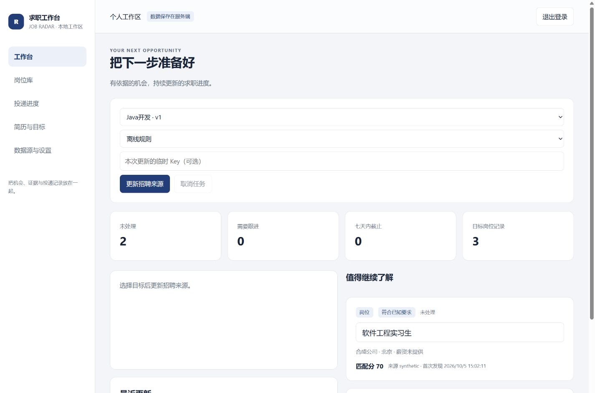
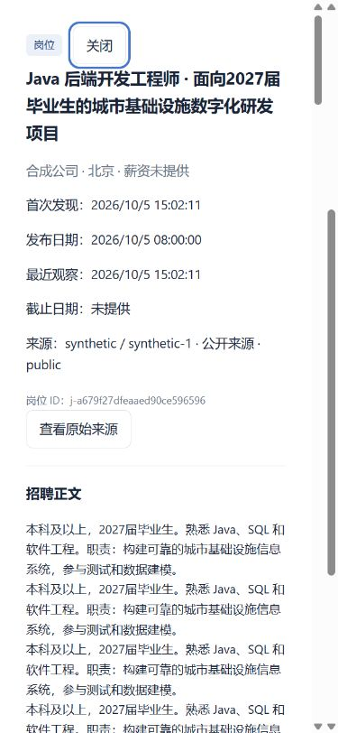
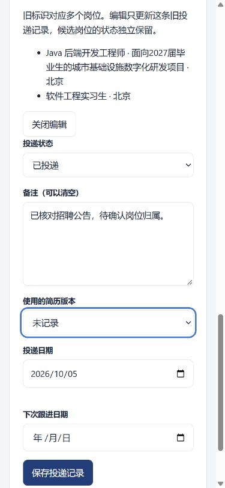

# Job Radar v2 发布验证

验证日期：2026-10-05，Asia/Hong_Kong。隔离工作树：`C:/Users/31069/.codex/worktrees/b70d/简历脚本`。Node 24.16.0、Windows、Electron 44.5.1、应用 2.0.0。

## 实际执行结果

| 命令 / 检查                                                | 退出码 | 结果                                                                                          |
| ---------------------------------------------------------- | -----: | --------------------------------------------------------------------------------------------- |
| `npm run test:offline`                                     |      0 | 17 个离线套件通过；v2 118/118；6 个网络套件和未指定的包检查明确跳过                           |
| `npm run e2e`（执行 `node tools/test-v2.mjs --group e2e`） |      0 | 2/2：真实HTTP业务流、重启与导出；合成v1迁移/幂等                                              |
| `npm run audit`                                            |      0 | 信息性体检；旧导出符号保留兼容，synthetic test key 被启发式扫描提示；不是覆盖率或正式秘密扫描 |
| `npm audit --json`                                         |      0 | 0 漏洞                                                                                        |
| `npm run dist:desktop`                                     |      0 | 便携包约362.0MB、app.asar约41.1MB                                                             |
| `npm run verify:package`                                   |      0 | 1645 个ASAR文件；新模块、目录、preload、生产依赖存在；0 项问题，无用户数据或真实Key           |
| 打包exe `--self-test`，`Start-Process -Wait`               |      0 | 22 项实际检查，0 失败；五页、renderer隔离、系统加密保存/清除、可写目录、PDF文字提取           |
| `npm run test:deploy` / `test:desktop`（离线门槛内）       |      0 | 反代v2事件路径、打包和桌面结构检查                                                            |

Electron 运行时来自官方发行包，SHA-256：`9b382492dcfee91f8f9e92c91f7972550a1b95d2299cac72279dab33a600d7db`。最终审阅修复后重新执行完整离线门槛、打包、包验证以及打包exe的22项自检，全部退出0。

产物：`dist/简历岗位雷达-win32-x64/简历岗位雷达.exe`。整个目录一起分发；ASAR不包含原项目数据、配置和个人凭据。

## 浏览器真实操作

使用独立合成数据服务，假适配器和禁止外部来源请求的 transport；未输入真实简历或真实密钥。测试页面与本机服务为零公网来源调用。

- 1440×1000、390×844 两种viewport下，工作台、岗位库、投递进度、简历与目标、设置五页：页面scrollWidth等于clientWidth；导航可在自身容器内横向滚动。
- 长中文岗位标题及约9868字的详情弹层：小屏可读、无页面横向溢出。
- Enter打开岗位 / 提交记录；Shift+Tab在弹层首项循环至末项；Esc关闭并把焦点还给打开按钮。
- 实际清空备注与保存日期成功；投递看板显示空备注。空查询有明确引导。
- 公告详情明确不能直接视为完整岗位；缺失发布日期显示未提供。
- 测试曾发现三个 `replaceChildren(array)` 与单列grid最小宽度问题，均修复后真实复验；稳定脚本/样式URL改为no-cache，避免后续升级继续使用旧资产。
- 最终修复后，用两个合成目标实际切换：同一实习岗位在Java目标显示70分，在SQL目标显示56分；各自运行历史正确切换。反序历史响应与旧流晚到事件另由回归测试覆盖。
- 待确认旧记录的候选岗位、原状态与备注可见；真实保存备注成功且候选岗位状态独立。390px视口下页面375px/scrollWidth375px，无横向溢出。见下方截图。

结果文件：[浏览器检查](assets/v2-browser-checks.json)。

## 数据升级与恢复

合成流程包含：导入预览→人工校正→保存画像→目标→部分来源失败仍保留岗位→保存已投递、备注、简历版本及日期→服务重启→中文Markdown导出→损坏备份恢复被拒绝且人工记录未变。

原 `E:/简历脚本/data` 只读预检，未写入：预期244个岗位、20次运行、163份人工记录；11项关联冲突保留，0跳过。21个迁移输入及SHA-256清单复制到当前工作树私有 `.cache/original-v1-backup-vlygea/`，未提交或打包。原目录正式迁移尚未执行。见 [预检摘要](2026-10-05-v1-preflight.json) 与 [升级指南](../v2-upgrade-guide.md)。

最终修复后再次只读预检，计数相同。迁移的规范身份别名可被后续采集识别，URL身份升级为来源ID时保持投递记录连续；不同来源ID仍保持独立。11项歧义记录保留为单独待确认记录，不自动复制给候选岗位。

旧运行正文写入经过脱敏的不可变快照，业务备份可恢复至空目录；兼容早期v2迁移留下的旧文件引用。恢复排队中/运行中的任务会标记为interrupted并清除进程所有者，不自动恢复执行。已采集事实在岗位库保留。

## 唯一独立审阅与修复

审阅范围：`3547885..71f49b2`，独立gpt-6-astra，根执行者按影响确认10项Important，并把来源健康记录从Minor升为Important11。未确认Critical。依照Native执行流程，实施一次修复轮次，没有重新派发审阅。

| 项目 | 修复与证明 |
| --- | --- |
| 1 身份连续性 | 迁移别名、URL→来源ID合并、来源ID冲突独立；失败测试→通过 |
| 2 歧义人工记录 | 待确认列表/详情/编辑API、独立UI面板、JSON/CSV/Markdown导出；后端与UI失败测试→通过 |
| 3 旧历史备份 | 迁移快照纳入业务备份，空目录恢复可读，密钥不导出；失败测试→通过 |
| 4 未完成任务恢复 | 恢复后中断、清除owner、可再次备份恢复；失败测试→通过 |
| 5 旧分重评分 | 无qualification的旧评价按unknown比较，人工记录保留；失败测试→通过 |
| 6 目录污染 | 事务内验证完整目录，内置ID冲突和缺字段以400拒绝且不落盘；失败测试→通过 |
| 7 退避重试 | 短暂失败到期可重试，未验证候选仍排除；失败测试→通过 |
| 8 目标评分 | 查询限定目标和版本，未评价事实保留；后端与UI失败测试→通过 |
| 9 目标切换竞态 | 历史请求代次/目标检查，切换只断订阅，晚到事件不回写；失败测试→通过 |
| 10 导出分页 | 单次权威快照，空页停止；并发筛选变化的失败测试→通过 |
| 11 来源健康 | 探针保留lastSuccessAt，日常采集也写健康与退避；两项失败测试→通过 |

新增15个回归测试，修复前全部失败，修复后全部通过。最终全套v2为118/118；完整离线门槛17通过/0失败/7明确跳过。审阅的6项未判定范围及其裁决见 [执行裁决](2026-10-05-execution-decisions.md)。暂缓Minor：无。

## 来源验证

此前同日真实来源探针取得6个新增直连provider / 4类渠道 / 30个ready站点，详见 [来源报告](2026-10-05-source-readiness.md)。这些值是该次网络观察，不保证未来持续可用。候选目录、搜索摘要和手工导入不计直连。

微信公众号、微博、抖音只提供搜索发现与用户正文导入，没有已验证的直接自动采集通道。官方权限与公开访问证据详见 [社交研究](2026-10-05-social-sources.md)。

## 验证限制

- Docker CLI 29.5.3 / Compose 5.1.4 已安装，但Docker引擎命名管道不可用；未执行容器构建和启动。
- 无带真实密钥的模型质量、真实花费验收。30条匹配基线是开发者编写的合成标签，不能称为真实人工评测。
- Electron PDF文字提取成功；可选canvas警告不等于完成PDF位图渲染验收。
- 单共享工作区，没有多人资料隔离；没有发布公网或合并原项目。
