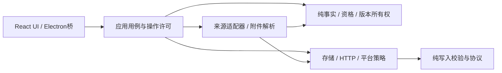

# 全源码结构审计记录

日期：2026-10-10。主审计者：full_source_audit；来源与附件审计者：collection_reference_audit。

## 范围与方法

使用 claude-mem:learn-codebase 的逐文件完整读取要求：先列清单，再分批读完，超出输出预算的文件续读到末行。审查沿调用链核对业务所有权、资格语义、缓存、预算、错误传播与发行路径；用合成对象、内存仓库、注入的 HTTP transport 或 fs mock 验证关键分支。本轮主审计不联网、不调用模型、不读取真实简历或岗位数据、不运行真实清理/恢复、不修改产品代码、不提交。

已阅读并沿用 [docs/superpowers/specs/2026-10-10-source-effectiveness-and-boss-design.md](../superpowers/specs/2026-10-10-source-effectiveness-and-boss-design.md) 与 [docs/superpowers/plans/2026-10-10-source-effectiveness-and-boss.md](../superpowers/plans/2026-10-10-source-effectiveness-and-boss.md)。新增 Boss 架构由该计划的实施与专项审阅负责；本报告主要补充原计划外的可验证问题。文件体积、同名函数和一次绿色测试均不单独作为缺陷证据。

### 主审计覆盖

| 范围 | 完整读取文件 | 收尾库存行数 |
| --- | ---: | ---: |
| src，排除另行委派的 sources/attachments | 122 | 29,795 |
| electron，包括 self-test 与 runtime fixture | 16 | 4,268 |
| public/js，包括共享校验与旧 UI | 37 | 6,270 |
| tools 中全部非 test-* 的生产/构建/诊断脚本 | 33 | 4,437 |
| Python 工作进程、构建 helper、requirements.in | 3 | 245 |
| 主审计唯一覆盖小计 | 211 | 45,015 |
| 委派来源与附件全读 | 50 | 12,790 |
| 总唯一覆盖 | 261 | 57,805 |

来源与附件代理完整读完50文件（46 mjs +4 JSON），并已完成[子报告](../../docs/reports/2026-10-10-source-attachment-audit.md)。初始48文件，收尾额外读取新增Boss适配器与城市表；路径库存核对时，src/electron/public/js 未读源文件为0。src 唯一覆盖172文件/42,585行。主审计实际阅读214文件，其中registry、catalog、content-queue在委派前已预读，与来源代理重复3文件/236行，合并统计只保留子报告的更新快照。

库存行数保留空行，不把末尾换行另算一行。SHA-256 清单计算于 2026-10-10T01:19:24Z。其他实施任务仍在更新代码，收尾库存不是原始读取时的冻结提交；本报告记录发现时的逻辑，修复是否成立由后续回归验证。后续新建文件需增补覆盖，不能凭本清单宣称未来变更已审阅。

### 明确未全读的范围

- node_modules、dist、public/app、.cache、.tmp 等依赖或生成物，二进制 PDF/图片/字体，以及生成的 requirements.lock。
- tests/** 与 tools/test-* 的全部测试实现；为定位验收缺口只阅读与发现直接有关的 fixture/断言，未把“存在测试”当作“行为已覆盖”。
- ui/** 的 React 实现由 UI 审阅代理另行全读，本报告不重复认领。
- public/js 旧页面当前未作为 React 主入口打包/服务；仍全部读取，但旧页面的问题单独标为兼容/清理建议。

## 需要处理的发现

以下问题已送交主实施者。优先级 P1 表示数据完整性或资格判断的高影响问题，P2 表示正常流程缺失、资源/一致性问题。除标为“静态调用链”的项目外，均以合成内容验证过；不代表真实平台可用性或实际用户数据情况。

### A1 · P1 · 合并证据复用私有记录 UUID，schema3 去重事务失败

定位：[src/domain/job-duplicates.mjs](../../src/domain/job-duplicates.mjs:564)；校验链：applyDuplicatePlan → 派生 combined_evidence observation → assertWorkspace/assertPackageOwnership。

派生观察通过 spread 克隆 current，仅替换 observationId，保留同一个 recordId。两个同包、同版本、权威 ID/规范 URL 相同的岗位可计划为一组；一个观察提供学历证据，另一个提供标题证据，合并生成新观察后，3 个 observation 只有2个 recordId。去重前 assertWorkspace 通过，去重后报 `Duplicate private record identity`。事务回滚，使用户无法完成包含证据补全的全版本清理。

最小改进：派生观察分配新的 recordId，重新计算所需 contentHash，保留 derivedFromObservationIds。建议在 tests/integration/package-dedup.test.mjs 增加完整 cleanup 事务、备份和 assertWorkspace 验收，不能只在兼容投影上验证合并数。

### A2 · P1 · 年龄下限/范围被当成年龄上限

定位：[src/domain/recruitment-evidence.mjs](../../src/domain/recruitment-evidence.mjs:255) 与 [src/domain/qualification.mjs](../../src/domain/qualification.mjs:324)。资格路径 evaluateRules → qualify → evaluateEvidenceConditions。

实际合成结果：`年龄20周岁以上` 被提取为 maximum 20；16/18岁通过、25岁不通过。`年龄为18至24周岁` 只留下24岁上限，16岁通过。资格执行也只比较 age <= values[0]，不读取 operator。若正文/在招/投递门槛全部满足，错误资格会进入推荐结论。

最小改进：明确 minimum/maximum/range 与端点语义，从完整年龄子句提取；不支持或冲突的句子保留 unknown。用16/18/20/24/25岁及“至少/不超过/以上/以下/至/含”边界测试。推荐测试文件 tests/unit/fire-airport-qualification.test.mjs。

### A3 · P2 · 证书“或”被拆成“且”，同句条件的证据 ID 也冲突

定位：[src/domain/recruitment-evidence.mjs](../../src/domain/recruitment-evidence.mjs:180) 与 [src/domain/qualification.mjs](../../src/domain/qualification.mjs:289)。

合成岗位：`須持有注册消防工程师或注册安全工程师证书`（复现用标准“须”）；本科申请人明确确认仅持消防工程师证。提取产生两个必需的单证条件，整体 AND 导致 fail。add 的 evidenceId 由 URL、type、start、excerpt 构成，同一句的两种证书产生同ID，后续 sourceEvidence 去重仅保留一条。

最小改进：一条子句构造 any/all 条件组，保留每个选项值和等级/注册要求；条件组与证据身份要稳定且无碰撞。分别测试“或”“且”“优先”“至少一个”“所有”，未明证书等级保留未知。建议 tests/unit/fire-airport-qualification.test.mjs + tests/unit/model-evidence.test.mjs。

### A4 · P2 · 改解析规则后，旧条件与评价仍可能复用

定位：[src/domain/recruitment-evidence.mjs](../../src/domain/recruitment-evidence.mjs:265)、[src/domain/qualification.mjs](../../src/domain/qualification.mjs:397)、[src/application/evaluation-service.mjs](../../src/application/evaluation-service.mjs:132)。

prepareRecruitmentRecord 和 qualify 都优先保留非空 record.conditions；评价缓存按 fact hash、RULE_VERSION、PROMPT_VERSION 等复用。A2/A3 修改后若只升级 RULE_VERSION，旧本地派生的错误 maximum/AND 条件仍留在事实中，再评分继续使用旧条件；不升级版本则连旧评价也可能命中缓存。该项为静态调用链核对。

最小改进：加入条件解析版本与来源标记，区分本地派生、外部结构化和人工确认事实；升级时只重新生成可重建的本地条件，保留来源证据；同时升级评价规则/缓存身份。测试“旧条件+旧评价持久化 → 升级 → rescore”而不是只测新鲜记录。

### A5 · P2 · 有效新增质量计数查询了原简历 ID，而评价属于目标私有副本

定位：[src/application/collection-service.mjs](../../src/application/collection-service.mjs:228)，以及 package-version-service / package-runtime-service。

创建目标保留原来源 profileRevisionId，但目标自身 profileSnapshot.revisionId 为 copy-package@1。运行与评价使用私有副本，service.get 用 root.targetSnapshot.profileRevisionId 查询匹配评价。合成 schema3 仓库包含1条完整正文、有效投递与在招证据、资格通过的副本评价；直接以副本 ID 查评价成功，collection.get 的 validNewUnique 却为0。

最小改进：质量投影从根活动实际 profileSnapshot.revisionId 获取资格引用，保持旧根活动兼容；不要改成跨包寻找任意评价。建议 tests/integration/collection-activity.test.mjs 或计划新增质量专项：副本1条应计1，不同版本同岗位不得互借评价。

### A6 · P2 · 桌面关闭失败后会一直阻止退出

定位：[electron/main.mjs](../../electron/main.mjs:613)。

shutdownDesktop 缓存单个 Promise，仅所有 await 完成后设置 shutdownComplete；before-quit 先 preventDefault，已有 shutdownPromise 则直接返回。若 applicationContext.close 或 collectionBrowser.stop 拒绝，finally app.quit 再次被拦截，旧拒绝 Promise 永久存在，后续退出也无法推进；其他清理步骤也未执行。该项为静态生命周期调用链核对，未声称实际 Electron 崩溃复现。

最小改进：提取关闭协调器，逐项尝试清理、记录固定诊断字段，并在 finally 完成关闭状态；注入 close/stop 的拒绝验证 HTTP关闭和最后退出各一次。避免吞掉诊断或递归重启相同清理。

### A7 · P2 · 每次调用的取消/超时不传到 DoH 物理请求

定位：[src/infrastructure/http/client.mjs](../../src/infrastructure/http/client.mjs:279) 与 [src/infrastructure/http/dns.mjs](../../src/infrastructure/http/dns.mjs:71)。

HTTP 客户端通过 abortable 提前向调用方返回错误，却只把诊断字段传到 dnsLookup；DoH 使用工厂捕获的 signal。创建客户端时无默认 signal、调用单次 request 时传 options.signal，20ms后取消，调用方 AbortError，合成 transport 仍看到 A/AAAA 两条请求 signal.aborted=false，直到独立5秒期限。

最小改进：dnsLookup 支持单次 signal，合并默认与每次请求的信号，HTTP 客户端传实际 combined；测试超时与用户取消后两条 DNS transport 均停止、预约和未知用量结算正确。建议 tests/unit/dns.test.mjs + tests/integration/http-client.test.mjs。

### A8 · P2 · 设置修改跨 config 与 workspace 非原子

定位：[src/application/context.mjs](../../src/application/context.mjs:582)。

updateSettings 先写 config.json 并更新 live cfg.deepseek，再调用 mutateWorkspace 保存预算与模型白名单。若工作区写入失败，界面显示失败，但配置和当前模型已经改变，预算仍旧；下次启动状态也分裂。该项为静态调用链核对。

最小改进：统一权威配置或明确 intent/recovery 协议；先完成验证与写入许可，避免声称两个原子文件等于跨文件事务。通过注入 workspace 写入失败验证持久文件、内存配置和预算一致。建议 tests/integration/api-bulk-settings.test.mjs。

### A9 · P1 · npm run clean:data 默认删除正在使用的模型配置

定位：[tools/clean-data.mjs](../../tools/clean-data.mjs:64)；有效性证明：[src/config.mjs](../../src/config.mjs:34) 与 [src/application/context.mjs](../../src/application/context.mjs:583)。

默认网页版 dataDir 为项目 data；updateSettings 正式将模型/API设置写入 data/config.json，resolveConfigPath 优先读取它。清理脚本仍按“旧版本残留不生效”直接删除该文件，且默认不是 dry-run。内存 fs mock 执行原脚本逻辑：dry=true 保留，dry=false 删除有效 config；未调用真实 fs 删除。

最小改进：配置永不进入产物清理清单；清理只依据显式受控测试目录/旧日志保留规则，使用统一 layout。新增配置保留测试，并更新旧注释/诊断脚本，不迁走或明文输出用户密钥。

### A10 · P2 · 旧回收恢复脚本的前缀校验接受相邻目录

定位：[tools/recover-recycle.mjs](../../tools/recover-recycle.mjs:72)、[tools/recover-recycle.mjs](../../tools/recover-recycle.mjs:81) 与 [tools/recover-recycle.mjs](../../tools/recover-recycle.mjs:116)。

该旧维护脚本需要显式 --apply，不由桌面回收站触发。合成路径验证：E:\\简历脚本-backup\\fixture.json 与 E:\\简历脚本\\..\\other\\fixture.json 都被 startsWith(TARGET_ROOT) 接受，resolve 后均不在目标内；copyFileSync 默认可覆盖已有文件。

最小改进：解析后的绝对路径使用完整根/分隔符边界，拒绝符号链接/越界来源；默认不覆盖，冲突记录并跳过。无需触碰真实回收站即可用 path.win32 和 mock fs 验收。

### A11 · P2 · schema3 核验事件索引了错误的投递 key

定位：[src/application/job-verification-service.mjs](../../src/application/job-verification-service.mjs:106) 对比 [src/application/package-job-service.mjs](../../src/application/package-job-service.mjs:49)。

核验后用 w.applications[jobId] 找记录，schema3 map 实际 key 为 a-UUID，记录内部 jobId 与 ownerPackageId 才定义关联，因此正常投递记录缺失 recruitment_verified 事件。岗位事实仍更新。该项为静态调用链核对。

最小改进：按 jobId+ownerPackageId 找所属包投递，复用统一查询函数；tests/integration/job-evidence-verification.test.mjs 验证所属投递的核验事件及异包投递不变。

### A12 · P2 · 部署诊断原样输出登录口令哈希

定位：[tools/check-deploy-env.mjs](../../tools/check-deploy-env.mjs:25)，入口为 package.json 的 npm run deploy:check；auth.passwordHash 为正式配置字段。

该诊断脚本直接 JSON.stringify(cfg.auth)，将 passwordHash 一起写入终端，可能随诊断复制/归档传播。合成 auth 对象确认输出包含 synthetic-password-hash；未读取真实配置或执行联网诊断。

最小改进：仅输出 enabled、passwordConfigured 布尔值和非敏感期限白名单；诊断工具也遵守不输出凭据的约束。建议用捕获 console 的合成配置验证 hash/token 字段始终不出现。

### A13 · P2 · 社交调度器收到执行任务，但失败反馈写入另一个调度器

定位：[src/infrastructure/http/client.mjs](../../src/infrastructure/http/client.mjs:260)，反馈位置371及400行。

默认 scheduler 为 sharedScheduler；社交 origin 会选择 sharedSocialScheduler.run，却始终调用 scheduler.recordOutcome。故共享社交调度器不接收自身的429/503与时延反馈，冷却/节流状态失效；默认全局调度器反而接收其他队列的响应。该项为静态对象身份与调用链核对。

最小改进：每次确定 effectiveScheduler，一致用于 run 与 recordOutcome；注入两调度器验证社交/非社交执行和反馈归属。建议 tests/integration/http-client.test.mjs 或 collection-egress.test.mjs。

## 来源与附件的交叉发现

来源代理已用离线 mock 验证下列10项缺陷，详细路径/行号、合成输出与4项尚未运行复现的风险见[来源与附件子报告](../../docs/reports/2026-10-10-source-attachment-audit.md)。主报告避免重复改动其模块。

1. legacy 适配层把没有独立 fetchDetail 的高校渠道 maxDetail 固定为0；旧采集实现唯一岗位输出来自详情，导致列表非空而正式适配结果为0，coverage 却完成。
2. 高校招聘公告的子岗位被 base.title 覆盖，消防工程师/机场安全工程师同城可变成同公告标题和同 ID。
3. legacy.fetchDetail 不 claimDetail，maxDetails 不能约束这条详情链。
4. 官方公告先检查正文30字再发现附件，“详见岗位表”短正文会丢失附件入口。
5. 微博 JSON 文本锚点 href 在 plain 中消失，外部证据链接未提取。
6. 社交列表 HTTP500/业务失败可能被当作成功空页。
7. 附件输入列表41项、输出40项时丢失末项状态，未提示其未处理。
8. 牛客内嵌JSON存在但损坏时被吞为成功空页（完全缺标记的错误分支已正确抛出，不能混为同一缺陷）。
9. 牛客岗位缺ID时产生字面量undefined并提升为权威ID，详情URL无效；该探针不代表已证明后续误合并。
10. DOC转换器首次临时探测失败会永久缓存rejected Promise，后续状态恢复仍无法再探测。

修复优先级：恢复真实岗位产出 → 保留子岗位身份 → 预算/失败状态 → 附件及外部证据。应保留限额、显式 partial 与可恢复游标，不能通过“永远增加上限”隐去未完成采集。

## 有益的结构改良

这些是具体边界问题的最小调整，不是另起框架或按行数拆文件。

| 边界 | 观察 | 推荐方向 | 需要保留的契约 |
| --- | --- | --- | --- |
| 事实与去重 | job-facts ↔ job-duplicates ↔ duplicate-candidates 存在静态相互引用 | 把规范事实/ID/冲突基元下沉到无存储依赖的纯模块 | 现有 fact hash、版本事实、保守判重语义 |
| 领域与仓库 | domain/ingest-records 从完整 repository 引入 contentHash | 抽纯 stable-hash 模块，旧入口重导出 | hash序列化字节完全一致，否则会破坏缓存/身份 |
| 写入许可 | repository 引 application/workspace-operation；调用处重复所有权/epoch/lease 检查 | 纯写入 guard 下沉，应用仍编排事务 | 原有撤销与迟到写入拒绝 |
| 备份/删除 | backup ↔ legacy-backup-sanitize ↔ application/purge-service 循环 | 分离归档编码/纯净化/删除编排 | 密钥排除、tombstone 与无法复活的回收子集 |
| 平台策略 | src/application/content-read 与 worker-protocol 引 electron/network-policy 的纯规则 | 将纯平台许可迁到 src/infrastructure，共享使用，Electron留监听/窗口 | 同样的精确主机/路径/方法白名单 |
| 版本投影 | package-workspace 与 job-duplicates 各自复制所属包投影 | 一个受测的 owned workspace projection | 同版本查询和跨版本绝不共享个人业务 |
| 条件解析/执行 | 提取、证据ID、OR/AND、缓存版本分散 | 一种明确条件数据语义和派生版本；解析/执行分别纯函数 | 缺证据未知、模型不能覆盖硬约束 |
| 关闭协调 | 关闭状态与 Electron before-quit 耦合 | 可注入纯生命周期协调器 | 取消、监听排空、最后退出 |
| 生产工具 | legacy健康检查、清理规则、目录注释和当前 schema/layout 漂移 | 工具清单标 active/legacy；通用探针复用正式 registry/ledger/layout | 诊断不能泄露配置/简历，维护默认可预览 |

补充观察：ranking-config 的 weights 声明与 ranking 内硬编码数值当前相同，但没有单一消费路径，属于未来漂移风险而非现有错误；旧 match/* 算法仍用于兼容/合成基线，不能因没有直接 React 引用就删掉。旧 public/js 页面完整读取后确认不属于当前主界面发行，应在依赖与兼容验收后清理或明确归档，避免同时维护两套交互。

### 推荐依赖形态

调整应逐步通过当前测试进入现有实现，不增加第二套模型预算、采集队列、个人数据仓库或全局登录材料。

## 验收建议

- 去重必须对 schema3 真事务后执行全局 recordId/ownerPackageId 引用完整性校验；版本之间重复可各自存在，同版本合并必须保留多源证据。
- 资格 golden cases 同时覆盖提取、执行、既有条件升级和缓存失效；只对新输入断言通过不能证明旧库修好。
- 来源验收以正式 registry 的完整调用链，分别记录列表、正文、投递与在招证据；HTTP失败不得等于成功空页。
- 预算验证计物理请求/详情/附件和失败保守预约，取消不能仅使上层 Promise 返回而下层传输继续。
- 设置与维护验收用失败注入/mocked fs，确认凭据配置保持一致且维护不会删除有效配置。
- 本报告不代替主任务的完整离线回归、桌面 EXE 自检、真实来源测试或用户简历匹配验收。

## 主审计逐文件覆盖清单

| 完整读取路径 | 收尾行数 | 收尾 SHA-256 |
| --- | ---: | --- |
| [electron/bundled-runtime-self-test.mjs](../../electron/bundled-runtime-self-test.mjs) | 338 | `c3f9e6062d69c8819e03bd6d19846264abeb416c1fea036bfdddb0703fa82079` |
| [electron/collection/boss-page.mjs](../../electron/collection/boss-page.mjs) | 121 | `0612ee1f39c72c09d5be1f9a750dda1dc609d59aa5f4623f5be29de9c685e9ab` |
| [electron/collection/browser.mjs](../../electron/collection/browser.mjs) | 675 | `abb12ef55c5b601ec4c46eeb61b77e30980836fdaed0c0fec4299c8f2dbaaef2` |
| [electron/collection/ipc.mjs](../../electron/collection/ipc.mjs) | 73 | `f1c806bed6eb87e4d5f52819f8cb6f8a7395df26cac625559d505259f7f898d5` |
| [electron/collection/network-policy.mjs](../../electron/collection/network-policy.mjs) | 280 | `35a3f0420ccab589d4bdc1ed743ca710a3273d1563a107149a9008e7928261e2` |
| [electron/collection/sessions.mjs](../../electron/collection/sessions.mjs) | 318 | `ef58f256c848593902cc35623415aec1067fbeb81388629298aeb341fe7e18fc` |
| [electron/credentials.mjs](../../electron/credentials.mjs) | 171 | `b1845db9b51104f68eacc966c385c9b0e96a0547c6c01b3717822c3ab4651316` |
| [electron/diagnostics.mjs](../../electron/diagnostics.mjs) | 152 | `1fbdc7ac59ff7706cb07e8c0a5f7802678c1da58d785595894b25ac8bce5de1d` |
| [electron/directories.mjs](../../electron/directories.mjs) | 80 | `2f991309bdab332dca7828c9d76576a6c9ea77f43155f4c8fe1bc1919f937d12` |
| [electron/fixtures/runtime-probe.py](../../electron/fixtures/runtime-probe.py) | 67 | `256b1a7f536be32e998e2a84461be3c5b4611a58281471436f904503a9198348` |
| [electron/main.mjs](../../electron/main.mjs) | 711 | `1c6a5ffa33125b8029c794bc7a46960c144b8ad7d3080ed7016d0697aa592e1e` |
| [electron/preload.cjs](../../electron/preload.cjs) | 27 | `7601fbb55675b3c48413254d2a0d569994ac9e5ebb470b7fc9543787557a0b7c` |
| [electron/process-output.mjs](../../electron/process-output.mjs) | 17 | `4b7fe4236d7b3e4438b2cd522af6c39bbcd1d76dc36bf86ba6d800636a294638` |
| [electron/self-test-network.mjs](../../electron/self-test-network.mjs) | 201 | `85333104aeec01c91a95d6bae905a445097be6e2617f4bbbb01d3102bd848c78` |
| [electron/self-test.mjs](../../electron/self-test.mjs) | 1027 | `66f307d608becfdcb1abfe2b37448e290cf82e71fd6b4ec5d4a660922d3595ab` |
| [electron/startup.mjs](../../electron/startup.mjs) | 10 | `5c2e200e06be43b3e245838d90f3db8bff7ff17ea712a51bcaed4f197f5cda2a` |
| [public/js/api.js](../../public/js/api.js) | 274 | `ca31ea23b367fea59651b598314ee1f8bd49d6cd157f9b9a3de8d71b6cf1b0f1` |
| [public/js/components/application-board.js](../../public/js/components/application-board.js) | 51 | `52cafa46f5ac5659db28f3df35ff2e853ce5d3e833f8cd03fd8224a23d2345b2` |
| [public/js/components/application-form.js](../../public/js/components/application-form.js) | 156 | `b609e3dd665e3c599783284e49d05d91578226aa652f59adeeb9d4028471b395` |
| [public/js/components/backup-panel.js](../../public/js/components/backup-panel.js) | 158 | `0f65ff712a59f066d0ce02531655836432504e8de4c3866f952088d548948317` |
| [public/js/components/data-locations.js](../../public/js/components/data-locations.js) | 95 | `278c52bd169dee3e1b62754cd5369d06e9f7c9464a283ccb7c930fcc5661838b` |
| [public/js/components/diagnostics-panel.js](../../public/js/components/diagnostics-panel.js) | 353 | `6f09fcd03ea45a4499d0af8ede55102f0685f3c0eacfb35c9e8a49aed4518f30` |
| [public/js/components/dom.js](../../public/js/components/dom.js) | 63 | `dfb0ed11a25a42ef15b77dc8da0758c513874226645ad471b50ed07561ae7a65` |
| [public/js/components/duplicate-cleanup.js](../../public/js/components/duplicate-cleanup.js) | 254 | `661789429a625c5fde45266436c7fe197feee136128f330955507a48992f8023` |
| [public/js/components/duplicate-compare.js](../../public/js/components/duplicate-compare.js) | 98 | `5a21219917c0f87e3cbe2173b865b6d0ab5ecc09c7dd1d0be6840f83b3ff7163` |
| [public/js/components/feedback.js](../../public/js/components/feedback.js) | 21 | `32c974a5817e6626a07e057b8f4cdb615fee3398a1cbae73556728ef47fccd38` |
| [public/js/components/form-validation.js](../../public/js/components/form-validation.js) | 163 | `e57c76f99c52eeaa204b4fb5e5247227f6b0ba0021d2c70a658929a6141f16ee` |
| [public/js/components/job-detail.js](../../public/js/components/job-detail.js) | 294 | `8a3a17cf2eb6b2471a91ca3a3c0e39b5d6f611f69375c16a52c1ef4908850e9c` |
| [public/js/components/job-filters.js](../../public/js/components/job-filters.js) | 106 | `fb48c9a8c26b0e3d414d43031e986d4fd471fa56c2b98d859f6ab79b8b952abd` |
| [public/js/components/job-import.js](../../public/js/components/job-import.js) | 96 | `f91c66479f7fb27baf7983dbbe83e7120f6595e61be894e5ab35d33e80090ef6` |
| [public/js/components/job-list.js](../../public/js/components/job-list.js) | 119 | `951ca2756205a93ee009d5afad7973e6e6628c5ad76648a6369bd5865312becc` |
| [public/js/components/model-settings.js](../../public/js/components/model-settings.js) | 221 | `fe509de3099900cd29ab8e2129d7e2665ce3cbff4de421b17e8fe112a112ad21` |
| [public/js/components/profile-form.js](../../public/js/components/profile-form.js) | 193 | `0769370557d30b4295a86a4ced244fcc18a39534118dd62d19e63f46f915e8b1` |
| [public/js/components/run-progress.js](../../public/js/components/run-progress.js) | 282 | `a5e13c9983cda55f510cb6453dd6de9238554c35eba8b7fe8cf7f1ade9692c58` |
| [public/js/components/shell.js](../../public/js/components/shell.js) | 138 | `c7d2c4b59381a66d468a023a1152b020ec7bf56150f161a7ee193da2a2e9230a` |
| [public/js/components/source-table.js](../../public/js/components/source-table.js) | 209 | `7bf86b15795a81ed646fc9f37372bc79aa65cdcc5cee135e9982c3a803027316` |
| [public/js/components/target-form.js](../../public/js/components/target-form.js) | 265 | `7a87ad67cc47db97aa890154a3bb16e774170eda7313c3ad4a377c0aeedeca56` |
| [public/js/components/version-list.js](../../public/js/components/version-list.js) | 161 | `7b7087eddb08e4c240c6ccd39510930ba8acd34714a7e5453b8225e8a1436445` |
| [public/js/credentials.js](../../public/js/credentials.js) | 13 | `38d154d4ad7942b383ce4d43076049f3a38bb1c095f35b3ffad862b072116a77` |
| [public/js/diagnostic-reporting.js](../../public/js/diagnostic-reporting.js) | 62 | `0f0f6fdf6692fdac7ef01660382a489885f8f7d4fd9766a7dd3c53b2c229c5a7` |
| [public/js/diagnostic-rules.js](../../public/js/diagnostic-rules.js) | 83 | `222c765ec26cc9aa4929643c7f3c3f64d95bd2853b1fd05202fb5a1e3cfc1153` |
| [public/js/format.js](../../public/js/format.js) | 79 | `57617bbb7dee771c1a970271e8003161a004892939dcdbb3a79a9aba975354e5` |
| [public/js/jobs-data.js](../../public/js/jobs-data.js) | 30 | `489661501ec6d0c8d86200be65c8b77b264d90ef75d1683556bbc142830a468d` |
| [public/js/main.js](../../public/js/main.js) | 54 | `acc7d2833f86ed09aaeef80e17d9203b6605559387ede796b99cc982403845e4` |
| [public/js/pages/applications.js](../../public/js/pages/applications.js) | 203 | `b064ab639e8188e9f73bbf4204c18be212b93f2352b1c14f59bcd13392a28289` |
| [public/js/pages/jobs.js](../../public/js/pages/jobs.js) | 209 | `1f4e9e00558e777f679812fad9e058bdf2bd941172297e5bf9fe6cf7079db210` |
| [public/js/pages/profiles.js](../../public/js/pages/profiles.js) | 327 | `eeab75cf0ad40193edd214304859d83f501d64bd007a52c7d2342ef9d16dd209` |
| [public/js/pages/settings.js](../../public/js/pages/settings.js) | 185 | `78d3f583e2ad36eda98d3d50b394ced7463fa26aa35601ae537c878daef98e9b` |
| [public/js/pages/workbench.js](../../public/js/pages/workbench.js) | 453 | `f58cc902120dd5dd7ab0f24e5a1b9bd03834a8c9572adefe84534dd555018a7a` |
| [public/js/router.js](../../public/js/router.js) | 26 | `35ba9cc9fd423f29c1b7524094fbc5e74d0e77b0a90a733cfd0fc5dd423b4dce` |
| [public/js/state.js](../../public/js/state.js) | 109 | `c3b3f847e4bce427019c286075d30e0fa4d15b4b5a8e369b004214b2140a02ee` |
| [public/js/validation-rules.js](../../public/js/validation-rules.js) | 605 | `94cc34e79b7d7e33ac23584db86378bf525525d806ba513bd7deafbefcc5107c` |
| [public/js/version-management.js](../../public/js/version-management.js) | 62 | `1f032e884ca1cd0242b37025c3744bee39f7d81421f204c5962e9762b2cb7651` |
| [python/build_chromium_credits.py](../../python/build_chromium_credits.py) | 30 | `f3efa663668805110f0d7898318b9cc3b0e286473e3880e711a1b5437b8aae22` |
| [python/collection_worker.py](../../python/collection_worker.py) | 210 | `744d54d428557d08012aee72e9a3bf0b02f00e9894392eaf1b4a880bd600a984` |
| [python/requirements.in](../../python/requirements.in) | 5 | `135379f7904f97795e1464ebcb753cc6d6a90bac95a6a08eac1a70a31e714bea` |
| [src/application/collection-ledger.mjs](../../src/application/collection-ledger.mjs) | 510 | `aa4618391415a22ccf1c93716c7cd6abb66017a9d1c5b0152b57f988f5bb4568` |
| [src/application/collection-refresh.mjs](../../src/application/collection-refresh.mjs) | 91 | `a99e2718c45969c2f033a0080bddab2573732d0c580b90482461a72f3f53dbd5` |
| [src/application/collection-service.mjs](../../src/application/collection-service.mjs) | 1673 | `84e7cab3315b34d2a48624d807e931c888281863812bbcb6f508fd6e772e28f6` |
| [src/application/content-read-service.mjs](../../src/application/content-read-service.mjs) | 140 | `d808422825f1d530612092096a96054cdf4299893bf66cbfa25f99c99629341e` |
| [src/application/context.mjs](../../src/application/context.mjs) | 701 | `acfd33eb078f4618646427b48e98766e3a058dc49e07c9f5430e208cf0753465` |
| [src/application/evaluation-service.mjs](../../src/application/evaluation-service.mjs) | 576 | `d6f52356e67c86f6b7db7c8623a86edc2e6bdd99f445b9342752f64e0b564cfc` |
| [src/application/export-service.mjs](../../src/application/export-service.mjs) | 177 | `98d30abc22b3cf64478736e6dec349fd0f533755df8a277cfbb7960618d1882f` |
| [src/application/import-service.mjs](../../src/application/import-service.mjs) | 137 | `acd03a1d7f6030b490559397542bef1fda766e927c5fc37e7783627735d80b94` |
| [src/application/job-cleanup-service.mjs](../../src/application/job-cleanup-service.mjs) | 108 | `8715afe433f555f34f79584fb4d9f4881d75af6a047c07cb4e95499169b2900d` |
| [src/application/job-service.mjs](../../src/application/job-service.mjs) | 587 | `0fc52382bfdda6f36c1c20fcb07bbbceba80719131098f7c94057e18c8f3660b` |
| [src/application/job-verification-service.mjs](../../src/application/job-verification-service.mjs) | 124 | `f76ea79f2c881e2abeca9980763afd48690abf4fdca61c56ca203bcad1da4c07` |
| [src/application/legacy-assignment-service.mjs](../../src/application/legacy-assignment-service.mjs) | 81 | `96adddd37100d67de014f81c2b21623bce7031bad5422cc43bd5ee00e491e185` |
| [src/application/legacy-scope.mjs](../../src/application/legacy-scope.mjs) | 17 | `49476b608c36e3a620c0cf5d622a97b984da6b3c39ce1452d16a6bbd890af26b` |
| [src/application/package-job-service.mjs](../../src/application/package-job-service.mjs) | 57 | `1f7b4b3afb308f8b7832e39923640afe1c3d5bba3316540d0f79b3f568fdf022` |
| [src/application/package-runtime-service.mjs](../../src/application/package-runtime-service.mjs) | 40 | `27815beb1d12e106afd2df4a97846683a767f9692ddfae780bc9f36a534c025a` |
| [src/application/package-version-service.mjs](../../src/application/package-version-service.mjs) | 362 | `33ee8979dd294e025b654bd4f19544d953f997fbd7cc9fcdc6417d45a3e22419` |
| [src/application/purge-service.mjs](../../src/application/purge-service.mjs) | 408 | `828de52f8a2c4deedcd606391cc2a54fa650b4cfefb45bc372d1ddf6c73e92ca` |
| [src/application/run-events.mjs](../../src/application/run-events.mjs) | 193 | `70d13e2a6868cce69df860d59ec4ad32c9672fe548d3b92142c458228b281d79` |
| [src/application/run-service.mjs](../../src/application/run-service.mjs) | 1283 | `a3fe055c3eb10e6ff921415e29822dc7c65ac9638b9019e4246ab3764d807a58` |
| [src/application/source-health.mjs](../../src/application/source-health.mjs) | 48 | `94af40d20c16858f595ec0a961cabfbc604a2f90f299be08288b123f15fc0512` |
| [src/application/source-service.mjs](../../src/application/source-service.mjs) | 585 | `eb83bec6f193dd49bfd826404078f7773b6cc5cbd56fe17c2a798274ec327539` |
| [src/application/trash-scheduler.mjs](../../src/application/trash-scheduler.mjs) | 73 | `06755832a74a5f34278602950a1e3bb94f15feb894d3c2d6f4df2fef49ad8cf2` |
| [src/application/trash-service.mjs](../../src/application/trash-service.mjs) | 393 | `654fbde414294d193e2481ef488378b900ed3b7e2ac30e636ad6cce5038ce9f9` |
| [src/application/workspace-operations.mjs](../../src/application/workspace-operations.mjs) | 241 | `b4bf4299b437f61b4263214849ad4646394ebd37b8a5718de454a758a771e291` |
| [src/application/workspace-service.mjs](../../src/application/workspace-service.mjs) | 468 | `6b1f8ae7460d96998cb1122f81009277a68633ea69c2aaa02214b227b0491698` |
| [src/auth.mjs](../../src/auth.mjs) | 230 | `14e87cd022d3cf50d87125841082d1cda9c88454083287e2dc09e1144e5be606` |
| [src/cli.mjs](../../src/cli.mjs) | 174 | `1f51d8670e712a3ccfc7effe465e12a90e8111f9b6bab14053187099f309e18d` |
| [src/config.mjs](../../src/config.mjs) | 423 | `ca9ed5149287ca213abf6f563b5da06350d7c8c4f7f221761174d886d510b835` |
| [src/doctor.mjs](../../src/doctor.mjs) | 273 | `65a9ebcf25f50684bc052723ca880d6138e28220a2ff6fb034de9a1b8c336d36` |
| [src/domain/collection.mjs](../../src/domain/collection.mjs) | 287 | `66aac6180e4cee647a966ecae634cb503f03422636f06607fdb719309650a4f3` |
| [src/domain/contracts.mjs](../../src/domain/contracts.mjs) | 132 | `894190aa7f1c3ed8bab1ad3ece27a9c6e69cc68a958f01925f6ddc51c3c86386` |
| [src/domain/duplicate-candidates.mjs](../../src/domain/duplicate-candidates.mjs) | 341 | `ccb11db89b3d90fb25dac33cfd329e0a6df999c618d6bb5814d964a3b6864b50` |
| [src/domain/identity.mjs](../../src/domain/identity.mjs) | 101 | `188f29bb857d608a72e0dd43aa43fdd2d865daf79f69e018813b82a30f64a913` |
| [src/domain/ingest-records.mjs](../../src/domain/ingest-records.mjs) | 290 | `2461137819eb67dbd82fb2ec6e9312a6e89940fb759c1a1c0df5ee44debd11e7` |
| [src/domain/job-duplicates.mjs](../../src/domain/job-duplicates.mjs) | 740 | `c54e8761be51cdb7a2f8663ed40c557e0397a6bce127854e4eca395737d9f119` |
| [src/domain/job-facts.mjs](../../src/domain/job-facts.mjs) | 326 | `1ee2003a1cb027a2101a987d3256e963f54a900614165b0f8b9cf876e0a8702b` |
| [src/domain/job-resolution.mjs](../../src/domain/job-resolution.mjs) | 121 | `f4b03e6e751d945278ccbea104da2d3123b29934fd2a29d8017ca1d94c43f5c4` |
| [src/domain/lifecycle.mjs](../../src/domain/lifecycle.mjs) | 49 | `90729578ddf60499bb1cab37a84a8ffbab439dee45f4afc356bb3b0bc0b3bdb0` |
| [src/domain/model-profile.mjs](../../src/domain/model-profile.mjs) | 127 | `276f42e60e4352296be523f5bc9a14dab37ad43616ab91c0a5da1f76352a1861` |
| [src/domain/ontology.json](../../src/domain/ontology.json) | 119 | `fd57dcbc4c6f2c8d097c0e7736ec8a4b5ac4deb0489051799edd27ae96f7dcc8` |
| [src/domain/package-ownership.mjs](../../src/domain/package-ownership.mjs) | 58 | `81cf5e18c0d1eb03a3495ee34fff40e8820dc4a9e38821f7e2675e7336fbf2f3` |
| [src/domain/package-workspace.mjs](../../src/domain/package-workspace.mjs) | 101 | `445d53bca1ec4361c6fab8526e508fb5482a8147a90730d351f6b9e3b9339be2` |
| [src/domain/packages.mjs](../../src/domain/packages.mjs) | 37 | `a4fc041aa9eb4ad95580a223ff1e38eb1d0dec476f2642082aff2633e1165773` |
| [src/domain/qualification.mjs](../../src/domain/qualification.mjs) | 419 | `cce64d183c8ab1a718a84b37396a3886e618ec2192f2163f3a9f530aabf71991` |
| [src/domain/ranking-config.json](../../src/domain/ranking-config.json) | 7 | `c2cab2f3f2aa35d703f2cdd006d709bade793839c0e11d551afe3558a4b08724` |
| [src/domain/ranking.mjs](../../src/domain/ranking.mjs) | 134 | `691a469ea42f705e6814dd906a013a98b14814810d1be43d57c4e88845d9e1d1` |
| [src/domain/record.mjs](../../src/domain/record.mjs) | 43 | `45f8ed1c86b663034a8f41d24081b81d15ba71eb2f4c18804c0d9d046396117a` |
| [src/domain/recruitment-evidence.mjs](../../src/domain/recruitment-evidence.mjs) | 412 | `c351b410d32869fb77380978f2cb9aa6ad1d6d38060d8689c999a5aa2bee9d64` |
| [src/domain/redact.mjs](../../src/domain/redact.mjs) | 17 | `dc44078ba779e8bfa1332edd749c43aa1a58277e3cc758d4341203c0884285c1` |
| [src/domain/skills.mjs](../../src/domain/skills.mjs) | 79 | `bca9fae6975234a5ad8a1d3bef139ae5e21ec95a1f465d3182123ae454469167` |
| [src/domain/version-names.mjs](../../src/domain/version-names.mjs) | 59 | `ae2733a305b28f604209ca46d0e144bd0e494b4a27ee23ebf9965b64c9702389` |
| [src/domain/version-references.mjs](../../src/domain/version-references.mjs) | 131 | `e22a544a45af84a83a0fe2f1cca608fe23d69a888f656c34a416c595f6f58572` |
| [src/domain/workspace-management.mjs](../../src/domain/workspace-management.mjs) | 189 | `1e6d62658a31a44a15d374f1f2e1565061a037c85fdb9831a74b627dccc4572e` |
| [src/export.mjs](../../src/export.mjs) | 159 | `3fc17bb87e7376159d4f42a30dd8344f3f0c07ce272c79bec68ccc29ceb09d0a` |
| [src/hash-password.mjs](../../src/hash-password.mjs) | 24 | `ee895c063ff50e369eb7d4f97a2a8b745b41a23f5e6dc03c7d38acc875d76b81` |
| [src/infrastructure/collection/egress-proxy.mjs](../../src/infrastructure/collection/egress-proxy.mjs) | 322 | `14b97cda68a59725a25809f4a94690ed5588c4a58b6b1ccd6aeaeee388d2b4fb` |
| [src/infrastructure/collection/runtime.mjs](../../src/infrastructure/collection/runtime.mjs) | 154 | `934c7341309d2e8a63794e49d8b0a83c99254422364cf625718e41c87025b42e` |
| [src/infrastructure/collection/service-capabilities.mjs](../../src/infrastructure/collection/service-capabilities.mjs) | 299 | `a76ec674bcfd9618e2a6594e66df6d12f1644369359d928a60c74e7c04574958` |
| [src/infrastructure/collection/worker-client.mjs](../../src/infrastructure/collection/worker-client.mjs) | 398 | `42dd609cd79a28f4c2f9d840e4cb115ae98d09278ef2ea64c3aff26a5d608a69` |
| [src/infrastructure/collection/worker-protocol.mjs](../../src/infrastructure/collection/worker-protocol.mjs) | 165 | `3d09c96e1f2d572b54df8ce1830f6378f87f29d8cb318ca373d566b68570fa23` |
| [src/infrastructure/diagnostics/fields.mjs](../../src/infrastructure/diagnostics/fields.mjs) | 368 | `be1b50ae0837d4db265183753941a34d366269e5749f3b363680f8709f3334e8` |
| [src/infrastructure/diagnostics/log.mjs](../../src/infrastructure/diagnostics/log.mjs) | 590 | `a708d8a9a9de550f73a5b4df89d931946e287f5a99c5a3ba6ec15f87bcd41437` |
| [src/infrastructure/http/budget.mjs](../../src/infrastructure/http/budget.mjs) | 36 | `1fab28502b84fe6b7ea29cea30944ed8429611e8f07d5281e25d95d62da853b3` |
| [src/infrastructure/http/cache.mjs](../../src/infrastructure/http/cache.mjs) | 28 | `1203c0e013b9cb451002e4912ec4e65d694760fd318108ba352601bd2580eae5` |
| [src/infrastructure/http/client.mjs](../../src/infrastructure/http/client.mjs) | 542 | `92f66c6a24887ab07d8e685a688f7f9d4648369e5adbe53f7873eafa6ea1dc6b` |
| [src/infrastructure/http/conditional-cache.mjs](../../src/infrastructure/http/conditional-cache.mjs) | 197 | `876ac2fc3757eb94e0a0a553831cc5a8f5ce821381377e42e2f3da0cfe36c958` |
| [src/infrastructure/http/dns.mjs](../../src/infrastructure/http/dns.mjs) | 152 | `4c3627ff48b7141b1b83b13fb0228520290d3f6a9941182b17d8e7ff2d56f0d8` |
| [src/infrastructure/http/public-url.mjs](../../src/infrastructure/http/public-url.mjs) | 89 | `1e9098f2ddc0e1ae0f100e81e640995cead887c07a95752b7f9e759fc7a67455` |
| [src/infrastructure/http/scheduler.mjs](../../src/infrastructure/http/scheduler.mjs) | 129 | `c152e1cdb6a22ff44ef4b300f45d4150c2dc575e104ab1fcf8c3f5bb4010fd8b` |
| [src/infrastructure/http/transport.mjs](../../src/infrastructure/http/transport.mjs) | 108 | `af9d57f3ca5b429ed88bf15f89ccd5d8ce8094174e520c090a2231dc721e6f8c` |
| [src/infrastructure/storage/atomic.mjs](../../src/infrastructure/storage/atomic.mjs) | 91 | `f082d766b96095447ea1339fa11e084376be5aa2dc20965aaac633bc867227cd` |
| [src/infrastructure/storage/backup-filter.mjs](../../src/infrastructure/storage/backup-filter.mjs) | 245 | `90b8c10605cc55e36f3a5118a8173e47cddd04eb7bd7d172d166e3b554ac5020` |
| [src/infrastructure/storage/backup.mjs](../../src/infrastructure/storage/backup.mjs) | 334 | `ea677156e6ac64eb944d508b8c5b098a275ac92b465ec9f63bff908b985d2874` |
| [src/infrastructure/storage/bootstrap-workspace.mjs](../../src/infrastructure/storage/bootstrap-workspace.mjs) | 168 | `4470b0995ca00805d90c2f5b70c93298c1b3caec1f35fb8fd4f3c651c6c42dcc` |
| [src/infrastructure/storage/layout.mjs](../../src/infrastructure/storage/layout.mjs) | 140 | `de9aa38aa33b863007dad8575fbb5206f8f3a78e3c3beba7b3411d64487a4860` |
| [src/infrastructure/storage/legacy-backup-sanitize.mjs](../../src/infrastructure/storage/legacy-backup-sanitize.mjs) | 415 | `d92485cc0f8aded579c03531411f6671d4983a3962198b80615e9de8f39f7fff` |
| [src/infrastructure/storage/lock.mjs](../../src/infrastructure/storage/lock.mjs) | 96 | `ea0d23a98cb2bc8f276580e6ec356e900d8dc88aee34d1563cb5ac6afdae3be9` |
| [src/infrastructure/storage/migrate-v1.mjs](../../src/infrastructure/storage/migrate-v1.mjs) | 318 | `43c00316e653fb1e39f3f359af5f86b6c11bc691a6ea3ab2714ce2bf2c6ec687` |
| [src/infrastructure/storage/package-control.mjs](../../src/infrastructure/storage/package-control.mjs) | 256 | `1ff6fb53beb286790d94386bb6f7eed7b4fc79da95da0eb39c9cb78648ac8d97` |
| [src/infrastructure/storage/package-migration.mjs](../../src/infrastructure/storage/package-migration.mjs) | 588 | `9b944791f5e6ddfa0fefe2f373fefdc81cf47e188edce876107dca37d29074d0` |
| [src/infrastructure/storage/process-owner.mjs](../../src/infrastructure/storage/process-owner.mjs) | 11 | `8bd6f65e897b20213e5cd0f0576892ecba7f12b79bafecf1aab78f0217e9815c` |
| [src/infrastructure/storage/purge-files.mjs](../../src/infrastructure/storage/purge-files.mjs) | 118 | `88215d7fe122e2e690184640e269bd9cdfc403c58ebc32026836427434551603` |
| [src/infrastructure/storage/recovery.mjs](../../src/infrastructure/storage/recovery.mjs) | 91 | `8d71f977a1e4e011ed632c4a50f6cf9a193d6074a44513bc4d5922346c0f5a0e` |
| [src/infrastructure/storage/repository.mjs](../../src/infrastructure/storage/repository.mjs) | 401 | `e3ec341cb816210f9d1d3c6f491adeacce02e55f3003fbb47a675610c93103ca` |
| [src/infrastructure/storage/upgrade-workspace.mjs](../../src/infrastructure/storage/upgrade-workspace.mjs) | 42 | `2d6c4e6d12546828045f5d9cb7e1266612b36af241f7a1b6471f1e591dddc0fe` |
| [src/limits.mjs](../../src/limits.mjs) | 178 | `0d0279c2aa6825f0796b370333b6f3fec5556d880111098dd8a67a536338ed38` |
| [src/llm/budget.mjs](../../src/llm/budget.mjs) | 300 | `476cc1f37ebcb8cc78bdcd1fa3ca75853c3a6c4fce113707ad5866c5b0d93ab5` |
| [src/llm/deepseek.mjs](../../src/llm/deepseek.mjs) | 450 | `dbec8734ddb36faec4796e466af59bb5dbab29ca3c1960046b2a806494597fd2` |
| [src/llm/prompts.mjs](../../src/llm/prompts.mjs) | 29 | `4a419717bafa979219829894fa2c28e61d3e8fd7b048c6740f12e959bd415e7a` |
| [src/llm/validation.mjs](../../src/llm/validation.mjs) | 86 | `71bb30960de98a5d12c2f1922959f6c19e4f652605d3b681057b7bd235af2226` |
| [src/match/article-evidence.mjs](../../src/match/article-evidence.mjs) | 80 | `5682140654d9703e9cc6377f4a56dfa19060e295135aee139599cd4e37b6285c` |
| [src/match/article.mjs](../../src/match/article.mjs) | 447 | `988b700f1d743df861bcf6950fef0ad22178bcfa9b201d025d2738ac42d54464` |
| [src/match/campus.mjs](../../src/match/campus.mjs) | 263 | `d8786be1addfdf7d3e1e0f1c7e3d475486c2a6693ad9e85a473a7c295210215b` |
| [src/match/destinations.mjs](../../src/match/destinations.mjs) | 136 | `e0cf1abfa64fef1819287c79fa4382b8accd650f4969733427c81fe8772bc8f3` |
| [src/match/enrich.mjs](../../src/match/enrich.mjs) | 42 | `959cd3c921fc231b2f123bf2e4f97c44e65c93c5b130eab628b62dcbe3e994c5` |
| [src/match/requirements.mjs](../../src/match/requirements.mjs) | 76 | `24bfa56762430b588a5174cbff99f6ff7b1ec2c6fffe04c8ef0ab2ca5da4397d` |
| [src/match/score.mjs](../../src/match/score.mjs) | 676 | `b46b51df63531b4e6ef03de34dd9fed2b4d9ec139aa6f2d58eb7fdb64a623015` |
| [src/pipeline.mjs](../../src/pipeline.mjs) | 495 | `0231f71098e2577073c90ad5f8d60578c9b9eaae4bac92906f71114652cfc6e2` |
| [src/resume/cities.mjs](../../src/resume/cities.mjs) | 20 | `3927da485bc140c227e5eebcd6a9516bd5524a0dff85190fcfb6c16c6060dec3` |
| [src/resume/docx.mjs](../../src/resume/docx.mjs) | 81 | `1c2e33aed94089bead1d814e5c8eb94e2561f2ba78dc1afbd1953596c2dd9b0e` |
| [src/resume/extract-text.mjs](../../src/resume/extract-text.mjs) | 157 | `e2d3f49465dd065d45008e99fde2c06ebf162d7a7b6ad65020c670fcc536ae70` |
| [src/resume/offline.mjs](../../src/resume/offline.mjs) | 121 | `6196f0fa9203133f8c289b67924105768a164bd51d1d599a7d075ce578001817` |
| [src/resume/pdf-layout.mjs](../../src/resume/pdf-layout.mjs) | 94 | `f936be04cf69e6f441f01c260e583b4e8d0ebccd2a6b75502a24555d9ffecad0` |
| [src/resume/profile.mjs](../../src/resume/profile.mjs) | 433 | `05e4bcad21a701511eb9a72e098e70dff7b943095c23cd47119523cd4c086181` |
| [src/resume/zip.mjs](../../src/resume/zip.mjs) | 108 | `3b24cf5a578bcbc266bf9611d5a0b64f72576c2113cadc914e7c912bef6cf74b` |
| [src/server.mjs](../../src/server.mjs) | 834 | `0e7ba36763b05dff47ccbb6fd3c91ddeba5c9df0eb644783b0ab041e12a0258b` |
| [src/server/collection-routes.mjs](../../src/server/collection-routes.mjs) | 79 | `c2c82b42f15050199d1a8e460c5c54437717bc485d9b4de5ac02f3828240db65` |
| [src/server/diagnostic-routes.mjs](../../src/server/diagnostic-routes.mjs) | 115 | `02970c385798d8ef667689db6d7ac32eccf43e33726ccee2d75670e6d63c9261` |
| [src/server/event-stream.mjs](../../src/server/event-stream.mjs) | 92 | `289d052f6381b6a89b5eb0d3aac5539559df0817d0d4f95600227f299c2f27cb` |
| [src/server/package-business-routes.mjs](../../src/server/package-business-routes.mjs) | 355 | `bfbcde922c870bbd14cb917a9a29b1965ec91ff21b9862ec41c23f5e70d89957` |
| [src/server/routes-v1.mjs](../../src/server/routes-v1.mjs) | 266 | `9875561db3e1bf983bf07e9bd1b20578ffe0efb692896e10c1eb35b2d3d00d06` |
| [src/server/routes-v2.mjs](../../src/server/routes-v2.mjs) | 557 | `8896a327d32f50a995716ba3fe53e5153beab1f45aa9f3fc6bcf422216f57af4` |
| [src/server/trash-routes.mjs](../../src/server/trash-routes.mjs) | 77 | `33bfa10432f89594b709b9c5526a4fb195f40b968837502bf0bfd3d6ad947f27` |
| [src/server/validation.mjs](../../src/server/validation.mjs) | 136 | `4d1d5a48a9472494d1f3e6a81f690cf0c27b29ecc350423dee0e949d94a3b1cf` |
| [src/sources/catalog.mjs](../../src/sources/catalog.mjs) | 70 | `d12b3175d1354c1b0fc6bb538c296510573eeb68f83bb147887708247d18d052` |
| [src/sources/content-queue.mjs](../../src/sources/content-queue.mjs) | 112 | `ef4853dda9b997ca5f10a4b44e7c7ee0081147858a85d153bb563546019942eb` |
| [src/start-public.mjs](../../src/start-public.mjs) | 80 | `a60315b564c0954d72ca3c6376d8906489050db227e673e8449f720ce4dcb6d5` |
| [src/store.mjs](../../src/store.mjs) | 279 | `8dd693dc830af6fd122670dbaf2e9e8360561533d0ad119796b79ddb667c6e85` |
| [src/util/html-elements.mjs](../../src/util/html-elements.mjs) | 79 | `e2e7ffa29b8c87cf68412b70f76c5168b93d3e3816b92471e5006813e5c938c0` |
| [src/util/html.mjs](../../src/util/html.mjs) | 259 | `02a1685ccd3b93d38a545b17c7a23f62c7d6bfe1746f8939274564f98949aa7f` |
| [src/util/skills.mjs](../../src/util/skills.mjs) | 381 | `bb7f8a8795907523afae0fb13163bea220b2dc8218c46e3f4163bfc932c9b35e` |
| [src/util/static-payload.mjs](../../src/util/static-payload.mjs) | 133 | `a0354cf3c5b6a7201ca9ddcc56ab754d7090201f5842604cdc305d6d9824ae27` |
| [src/util/text.mjs](../../src/util/text.mjs) | 231 | `1886e4ac44b3d8276d3483afb42ee277b423373647083f87917582ee922e0de9` |
| [src/version.mjs](../../src/version.mjs) | 4 | `a5670501ed0952c814385d8d3899ebb103bba7f5e0876acca7ec63ed5d7a1a19` |
| [tools/audit-project.mjs](../../tools/audit-project.mjs) | 217 | `597cba2da7d490bda1822ec91569ba1479b1778688b4a4367d3941145f86f247` |
| [tools/audit-registry.mjs](../../tools/audit-registry.mjs) | 57 | `6312218bf35683fde790827d7c2e40e6f6749cfe92548eeb9223b96e6312d355` |
| [tools/audit-soft-requirements.mjs](../../tools/audit-soft-requirements.mjs) | 113 | `8c2a1762291351bc1bbea0bb4c21f415739127e74f6f528abe43c7da4c7adb09` |
| [tools/build-collection-runtime.mjs](../../tools/build-collection-runtime.mjs) | 252 | `8c315b2307413d43f86da7830cd3a4cb62c761b85fc42f61a2be82a999c3340b` |
| [tools/build-desktop.mjs](../../tools/build-desktop.mjs) | 367 | `753d50149aaf892d655a313398fe9278bcd1c20f907b88d8b9ba502f710192dc` |
| [tools/build-ui.mjs](../../tools/build-ui.mjs) | 17 | `8e3a211ff764088f099764884f0e60d4e68508d7549b1211f27d68f4489feb2f` |
| [tools/check-deploy-env.mjs](../../tools/check-deploy-env.mjs) | 60 | `68e8678c2bf75032a3a576036141d5ceb6174454fb00ca3d3a24c8079ca4183e` |
| [tools/check-package-json.mjs](../../tools/check-package-json.mjs) | 24 | `b6f83e073c420d1d4bd9fbb459cf872e64dd02f9b3d5286ea9bedc71db231573` |
| [tools/check-sources.mjs](../../tools/check-sources.mjs) | 194 | `5211c9ebb04ad57ab42bea37aae39dbcbc996ed2bef57686083317bdc6becdad` |
| [tools/clean-data.mjs](../../tools/clean-data.mjs) | 86 | `97b449e5ea11b4331365da91a551c3553785ed3c727226d7f01d1aedd4a4c6b4` |
| [tools/collect-university.mjs](../../tools/collect-university.mjs) | 46 | `e46dd0ae6def01748fa5874273129ec4f3cddf7cf478c94d79ae7b4a3d70d94a` |
| [tools/discover-recruitment-sources.mjs](../../tools/discover-recruitment-sources.mjs) | 77 | `6d135eb60c1f7fe33c187e7524fb4ea44f8aade6887832dec65f042ed2d9d6ea` |
| [tools/eval-matching.mjs](../../tools/eval-matching.mjs) | 17 | `54da75fb5281c49c9ba7a553228d2a7474fb8ac694c2aa33fdcc7b79e95af23d` |
| [tools/fetch-electron.mjs](../../tools/fetch-electron.mjs) | 127 | `8c53dfe1d5e9895d8f99bc69e74c3f81abde454948260e6261ee2660b68115a5` |
| [tools/find-company.mjs](../../tools/find-company.mjs) | 92 | `78ce72bce63532a1dd4ddc6ab242a0ac340411329024846cea9d64e0a4fa10de` |
| [tools/find-orphans.mjs](../../tools/find-orphans.mjs) | 130 | `ec5f0b2b0e324a1cf83d4c32d4bbb554fcfe776447454830d1eb52eb6f429b1e` |
| [tools/lib/bundled-resources.mjs](../../tools/lib/bundled-resources.mjs) | 70 | `46b09d522bfbbc128b251b6a9508d7e86550436b64b7bc2aa8b87bb18b3db354` |
| [tools/lib/unzip.mjs](../../tools/lib/unzip.mjs) | 136 | `e2ec7cbd8fa084f95f3ff08323efdb45a052d52bba2aadf0b5d4c1051bdab8e2` |
| [tools/make-icon.mjs](../../tools/make-icon.mjs) | 246 | `4ab8c36c58de90444dfe9f35affa881362bbcb61de24d0afa4c7f4a3626ce11b` |
| [tools/pilot-recruitment-coverage.mjs](../../tools/pilot-recruitment-coverage.mjs) | 590 | `99ef965e15856fdd78e54b76287a37176b8c76b9bb8e317bed9402a3240dc44e` |
| [tools/prepare-ocr-resources.mjs](../../tools/prepare-ocr-resources.mjs) | 79 | `386520e6c0273c9a87c5137ca68324a75fb49f0e46837e00d918e8fc6e228b1e` |
| [tools/probe-font-stability.mjs](../../tools/probe-font-stability.mjs) | 96 | `39b6ae07f43b21a295a5d0322e2f7a85c644fbb2ef6f2bf115ba98460e6cc588` |
| [tools/probe-fontmap.mjs](../../tools/probe-fontmap.mjs) | 90 | `c95ebd81bdbf9a33c6d2135fbdb9e7e3aca833029f77c84fa758bf883b81271d` |
| [tools/probe-sources-v2.mjs](../../tools/probe-sources-v2.mjs) | 276 | `bbdf0d56a69715fb7aff72055075523fc6c1f7f4a9392a630b73542446a8354b` |
| [tools/recover-recycle.mjs](../../tools/recover-recycle.mjs) | 131 | `e4de8dc40d446a58d0e11d9105bf8764367ba40abe7523b3a8d8068e65476833` |
| [tools/report-school-selection.mjs](../../tools/report-school-selection.mjs) | 134 | `f925c510abc8cbb21f4eedfa0f7b13084adadb7b438d622928659cc9395f932f` |
| [tools/run-all-tests.mjs](../../tools/run-all-tests.mjs) | 159 | `26d8d9876aea804a9cf0cef90bcdedfba34ece330c443b628b76b2ee9758751f` |
| [tools/run-e2e.mjs](../../tools/run-e2e.mjs) | 59 | `6398b544fef348baa9301b7cc3be6b79b8778bdcefd38b0e5b6359d77b0abf42` |
| [tools/verify-candidate-hosts.mjs](../../tools/verify-candidate-hosts.mjs) | 100 | `bede21f8e47de150463202941f28a4bd14b20ea85c48044e76a3a3e5c503250f` |
| [tools/verify-collection-runtime.mjs](../../tools/verify-collection-runtime.mjs) | 20 | `794e25563d178c3ab38f64e7a95ced64817e654a77a58db65989a48134b919ec` |
| [tools/verify-desktop-self-test.ps1](../../tools/verify-desktop-self-test.ps1) | 41 | `1b16a58fc6503de693a76d823cc67bd027ceb79a90f318f3844b7f7c8e3114f5` |
| [tools/verify-package.mjs](../../tools/verify-package.mjs) | 261 | `46791fee9105ffe7888122bb36cb5f273b747340a5d420373b8da54d0656a4dd` |
| [tools/verify-source-catalog.mjs](../../tools/verify-source-catalog.mjs) | 73 | `8e7ecf3c9582cb96e991c627ccfbad13e60a41d59518cdb09d8cdbe6398ecb13` |

## 来源与附件覆盖补录

委派代理于09:23（UTC+8）完成以下50文件全读与SHA校验。随后主实施者继续更新代码。本节证明其已读快照，不能证明后续修改已被此代理审阅。

| 完整读取路径 | 已读快照行数 | 已读快照 SHA-256 |
| --- | ---: | --- |
| [src/attachments/cleanup.mjs](../../src/attachments/cleanup.mjs) | 158 | `25fa3fe9e22ab043e0f76ae40d39d68f7da2a367f5cf6cacfa150982992f3d95` |
| [src/attachments/doc-converter.mjs](../../src/attachments/doc-converter.mjs) | 105 | `28c47a75cdb87ac629863073bf039a194f921194bbecc0d6749a78a76c76f04d` |
| [src/attachments/docx.mjs](../../src/attachments/docx.mjs) | 60 | `b570273381f68664828c4a9bda9d0583bd060443c6520fd99138dc9826985b3e` |
| [src/attachments/ocr.mjs](../../src/attachments/ocr.mjs) | 139 | `4d474bdf3d38467e6da679132e6da94d48b89ca5c6c7508a106937afe5b28a93` |
| [src/attachments/pdf.mjs](../../src/attachments/pdf.mjs) | 69 | `1d675573f33639f240e44b8ecf92896c59c439f8ab06ae8f4de67a55af1fb366` |
| [src/attachments/service.mjs](../../src/attachments/service.mjs) | 316 | `5f264d71719bbf858e4449b915be4454168bc7e85c11f8041de04eeb829c070a` |
| [src/attachments/spreadsheet.mjs](../../src/attachments/spreadsheet.mjs) | 50 | `13da638fe1e18270bdd84cfb670b9f1eee327c63753a7950d8158c4457f8a8ca` |
| [src/sources/adapters/boss.mjs](../../src/sources/adapters/boss.mjs) | 68 | `8ab0cc53b008f9f83fca90ef760606ebf440498ec04db0c9f6d01d3ba01b90bb` |
| [src/sources/adapters/greenhouse.mjs](../../src/sources/adapters/greenhouse.mjs) | 112 | `6dde58676202e46e39aaf56f34f3284ea34a69c149c64b3e9ef75d39b9af20dc` |
| [src/sources/adapters/legacy.mjs](../../src/sources/adapters/legacy.mjs) | 251 | `4de888c482b4c9c7d1255a574c9c196ff3846dc58eca84cb65bf503722cbdebd` |
| [src/sources/adapters/ncss.mjs](../../src/sources/adapters/ncss.mjs) | 182 | `86dd005e026093d1c39e04e201ff4e07712a48b215955c60ef89c1e3303abd0f` |
| [src/sources/adapters/official-announcements.mjs](../../src/sources/adapters/official-announcements.mjs) | 218 | `a5990217871eb792bc5749e54b4f05b13c2686ada5e0c5945231d27701c61928` |
| [src/sources/adapters/shared.mjs](../../src/sources/adapters/shared.mjs) | 474 | `830232bfa55e6d1853cb74fa2c6bfaa22319b7c07e97320dc3a675c34f7e1df1` |
| [src/sources/adapters/smartrecruiters.mjs](../../src/sources/adapters/smartrecruiters.mjs) | 115 | `a9146cb1398f93b4df186899b9b5b53ebfe9578c9dc34d205cd223ab44773d5f` |
| [src/sources/adapters/social-discovery.mjs](../../src/sources/adapters/social-discovery.mjs) | 137 | `17fe3d0d896e5abf108bcf4e835ae4adeb46b63ddec38876316d5bb200519559` |
| [src/sources/adapters/tencent.mjs](../../src/sources/adapters/tencent.mjs) | 99 | `5ff10c771f9460c9fe8360c1d6c1d8993a175274fc2ea4f67d9a0adc5bf33380` |
| [src/sources/adapters/university-91job.mjs](../../src/sources/adapters/university-91job.mjs) | 221 | `051f208ecb20556c6288d8774608623489767ee293ec7aded530dd4829b37797` |
| [src/sources/adapters/wechat-authorized.mjs](../../src/sources/adapters/wechat-authorized.mjs) | 35 | `4bac0bc5726f4c9c57ea82bb266194be87090ec9f8c9250b6a52d2849f152052` |
| [src/sources/adapters/wechat-public.mjs](../../src/sources/adapters/wechat-public.mjs) | 152 | `76fae7bb5ae5df7ff6d4dd98b0910f7bf3318b2866d39f404769fdd9f88ab7da` |
| [src/sources/adapters/weibo-official.mjs](../../src/sources/adapters/weibo-official.mjs) | 34 | `8c3173500db63ac96fc21fecc27034599782f6cfbdb291df69e1a3903dca7060` |
| [src/sources/adapters/weibo-public.mjs](../../src/sources/adapters/weibo-public.mjs) | 217 | `d73c6ced0e440a57673998e3c500b9b4ed2b0c3cda71aba774daf916ef12fa3a` |
| [src/sources/adapters/yingjiesheng.mjs](../../src/sources/adapters/yingjiesheng.mjs) | 94 | `ff80fc5b7688342f7e14b8ecdf0575630c5d6dcc12c1be5939978cecb1b16966` |
| [src/sources/boss/cities.mjs](../../src/sources/boss/cities.mjs) | 20 | `bb1080f7ebe5677adbd7c64c9948a51eb8a5a77b13470d7b229577f3645cbf0e` |
| [src/sources/boss/protocol.mjs](../../src/sources/boss/protocol.mjs) | 113 | `f4414fa7b90d1a69a1baafe226eb11e0e4d6229a51bc0381f5d47f12d1a03aa8` |
| [src/sources/boss/records.mjs](../../src/sources/boss/records.mjs) | 88 | `d217c5c9287c460f7c528338c89d793a0c26581a4e5ec8d064d5f68dca275f23` |
| [src/sources/catalog/employers.json](../../src/sources/catalog/employers.json) | 1875 | `1a8f0f9a5bd6a86ea7bd4279fc30ed1b6c57b9473e0a14d424bac896dfbc6c6c` |
| [src/sources/catalog/platforms.json](../../src/sources/catalog/platforms.json) | 311 | `be980e352763192008a72cb5f082dda9a7d1341541e41e9e8c1801b5e4aa8067` |
| [src/sources/catalog/public-notices.json](../../src/sources/catalog/public-notices.json) | 350 | `baace9008fcb3901fd071cd62cae377bffe1277b240658cf2923a2dfe6e7ebf1` |
| [src/sources/catalog/universities.json](../../src/sources/catalog/universities.json) | 1503 | `1522589e6c8999944a8204cc3fc1657f52a9862436fad3cfa2c543a7ffe4d8a0` |
| [src/sources/chenyun.mjs](../../src/sources/chenyun.mjs) | 437 | `2e1bf7c0d7fb72241cb0b6737eb858d3173a34dd06c67e25532fae2c18789436` |
| [src/sources/collection-page.mjs](../../src/sources/collection-page.mjs) | 120 | `7ee3c69f80b60693a9ad1852fab17f82f55eba492c473fce53530de8231a69e4` |
| [src/sources/common.mjs](../../src/sources/common.mjs) | 39 | `6172638de6389a4a7b3210ac5513e2c93583a5845d0a9cda07b322a66bf4efae` |
| [src/sources/discovery.mjs](../../src/sources/discovery.mjs) | 149 | `c4c48f2b60a084a8848a4220c690d721cbb7e0b4330f1a2e26401b29984b577b` |
| [src/sources/fontmap.mjs](../../src/sources/fontmap.mjs) | 112 | `e1e1bf648c01bab1c4baf06c9219683c6503708c97fd697435533122ec1cb09f` |
| [src/sources/index.mjs](../../src/sources/index.mjs) | 357 | `58fd6cb03b74f6e6c993206a1e57d10ab7e8c2fd72edc3688f9d24c75e92627a` |
| [src/sources/jiuyeqiao.mjs](../../src/sources/jiuyeqiao.mjs) | 323 | `18680f537d27fbc57c58a32e9cfe04fca8b0ac5959635d9addcad71ab9787511` |
| [src/sources/nowcoder.mjs](../../src/sources/nowcoder.mjs) | 347 | `84d96759ce453d5310fd7c0a65556a66932d11085a90397fb57f5a25e110d33d` |
| [src/sources/planning.mjs](../../src/sources/planning.mjs) | 314 | `9429e116ea1477f44e8af8fbf976ec38213f6bfc61323c6d2be71255f983d5a9` |
| [src/sources/registry.mjs](../../src/sources/registry.mjs) | 56 | `217be8c5e4de8c29ff7a91fad869605846295cbd715b34adf302e433d490fdda` |
| [src/sources/request-context.mjs](../../src/sources/request-context.mjs) | 33 | `0be86f8f432b39172bb2bb619a79d5634c4f699fd9d9f8b877d768ed3e6f00cf` |
| [src/sources/searchapi.mjs](../../src/sources/searchapi.mjs) | 214 | `2e9d01f6d24cd89039425c23ec1fb34ec029973b7e5401bda5115ac16d544e9c` |
| [src/sources/shixiseng.mjs](../../src/sources/shixiseng.mjs) | 553 | `fcdf70ee7e2af8aa8e34b2ea3e0f359107659e16f8cd09399c370553758f5cf9` |
| [src/sources/social-content.mjs](../../src/sources/social-content.mjs) | 238 | `1bfe5dd2628105e71412ff09391569cbd95140ed84e00d44d06e31bb8915085c` |
| [src/sources/social-intent.mjs](../../src/sources/social-intent.mjs) | 30 | `bb45c53e8f7e5cc7a5a233ce38ce9e1fe8c49e4a8c7c87d508d6cbf25627ea0a` |
| [src/sources/source-quality.mjs](../../src/sources/source-quality.mjs) | 104 | `d2a696bdde961800111fa635314fb9cf008b787744a4dccc21ece155cc688afd` |
| [src/sources/university.mjs](../../src/sources/university.mjs) | 950 | `c3b0bd9b127a8ce6e355a06b2484574051098314d90013164ae71f818bb2ad06` |
| [src/sources/wechat.mjs](../../src/sources/wechat.mjs) | 387 | `de102fc0cddea4b2343a00f26678cd2245ae3fd32ccbf6344c715131ffab6637` |
| [src/sources/zhaopin.mjs](../../src/sources/zhaopin.mjs) | 279 | `bf9700203b9fc727c625bc99384e54be83d629773770fbc71cdf0f53e0dffd42` |

## 共享工作树后续变更

最终库存路径覆盖没有遗漏，但在读取快照之后已检测以下8文件hash变化，均属正在实施的Boss接入/来源操作。最新修改应由主任务专项审阅与回归确认；本报告未独立扩审新Boss计划代码，也未追逐并行变更来伪造一致冻结快照。

- electron/collection/ipc.mjs
- electron/preload.cjs
- src/application/collection-service.mjs
- src/application/source-service.mjs
- src/sources/registry.mjs
- src/sources/adapters/boss.mjs
- src/sources/boss/cities.mjs
- src/sources/catalog/platforms.json

后续新建的collection-quality/prompt-registry等计划文件不在本次库存中，应在创建后补充审阅。
