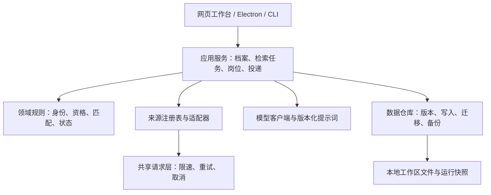

# 简历岗位雷达 v2：个人求职工作台设计规格

日期：2026-10-04（Asia/Hong_Kong）

源码基线：`3547885`，与 `E:\简历脚本` 原始源码一致；设计文档在隔离副本独立提交。

状态：2026-10-05 用户已通过其他设计，并要求扩大招聘来源渠道；本文已纳入该调整，实施计划待审阅，尚未进入实现。

产品方向：供用户本人长期使用，兼顾以后分享给他人。

## 1. 已确认的目标与设计选择

用户要求结合现有项目与 `E:\简历脚本\data\oss-research` 中的参考材料，对整个项目重新设计升级。用户已选择“个人长期使用的求职工作台”，并认可“保留 Node/Electron，重建业务边界和工作台界面”的渐进升级路线。

成功后的日常流程是：保存并校正一份简历画像 → 保存求职目标 → 更新岗位 → 判断值得投递的岗位 → 记录投递进展 → 下次打开继续处理。重复检索应复用档案、保留人工记录、展示真正新增的信息，并说明本次覆盖范围。

| 方案 | 取舍 | 决定 |
| --- | --- | --- |
| 渐进式模块化升级 | 沿用八类来源、Node ESM、Electron 与 CLI，逐阶段替换业务实现 | 采用 |
| 全面切换框架与数据库 | 同时迁移运行时、界面、存储与打包，验证面过大 | 暂不采用 |
| 仅修补现有脚本 | 可以修局部问题，无法形成持续管理简历、岗位和投递的统一流程 | 不足以满足本次目标 |

保留 Node >=20 的现有兼容目标；当前检查环境为 Node 24.16.0。生产代码继续使用 ESM，前端采用拆分后的原生 ES modules 与 CSS。允许为明确的正确性问题引入小型、纯 JavaScript 依赖，不把“零新增依赖”当成高于数据正确性的限制。

本版交付覆盖五个页面、共享业务核心、八类现有来源迁移、招聘渠道扩展、匹配与身份修正、旧数据迁移和验证体系。渠道扩展覆盖国家与地方就业平台、高校就业网、校招聚合站、企业招聘官网和央国企/行业招聘公告，具体接入标准见 6.5。扫描件 OCR、自动投递、云端多租户、向量数据库和自动定时后台检索留到后续独立需求。用户主动点击更新或使用 CLI 才发起本版采集。

## 2. 证据、参考材料与采纳判断

参考材料包含调研结论、上游源码子集与一个去重提案。它们是设计输入；对本项目的缺陷判断以当前代码和独立复现为依据。上游源码子集存在未下载的相对依赖，不能作为完整模块直接接入。

### 2.1 本轮已复现或核对的事实

| 位置 | 本轮结果 | 设计影响 |
| --- | --- | --- |
| `src/util/text.mjs` | `Java开发工程师I` / `II` 相似度 0.9，2 条合并成 1 条 | 去重必须保护明确职级与招聘编号 |
| 同上 | 同公司同标题的北京岗与上海岗，2 条合并成 1 条 | 城市与岗位类型冲突必须阻止模糊合并 |
| 同上 | `?pid=2` 与 `?pid=3` 生成相同 URL 键 | 保留身份参数和未知参数 |
| `src/store.mjs` | 一次空结果可以把此前岗位列为 disappeared | 搜索缺席不能作为下架证据 |
| 同上 | `firstSeen` 当前已保留；未发现 store 中 skills/tags 的无限并集代码 | 不照搬调研中针对其他实现的修复建议 |
| `src/resume/extract-text.mjs` | 合成 DOCX 输出 `姓名张三Java`，数字实体未解码，页眉联系方式未出现 | 修正正文顺序、段内分隔与文档部件读取 |
| `src/match/score.mjs` | `JavaScript` 命中 `Java`，`CAD` / `CET` 命中 `C` | 统一技能词条、边界和别名识别 |
| `src/util/html.mjs` | 合成 Nuxt 载荷可通过 `new Function` 设置进程全局内存标记 | 对远端载荷进行静态数据解析，移除执行路径 |
| 两个字体测试脚本 | 有真实网络请求，末尾无条件 `exit(0)`，缺少失败断言 | 探针与确定性测试分离 |
| 原项目数据 | 163 条岗位索引、20 份历史结果；仅统计数量，未在输出中展示个人内容 | 文件存储足以支持当前迁移，先建立正确持久化边界 |

上述复现均在内存中进行，没有改变原项目数据。它们是特定反例，不代表已经测量真实业务中每个问题的发生率。

### 2.2 采用与调整的参考思路

- 借鉴 `career-ops` 的 provider 契约、招聘编号优先、来源追溯和可重放评测；以本项目的中文校招语料和三种入口重新实现。
- 借鉴声明式源配置，但限定为站点参数和字段映射；复杂源保留解析模块，避免给任意配置执行 JavaScript 的能力。
- 借鉴“资格门槛与匹配分分开”，增加 `pass / fail / unknown` 和证据，避免缺失信息被等同于不合格。
- 参考去重提案的职级识别，但不默认降低“高级/资深”与普通岗位的合并阈值。没有同一招聘编号等充分证据时保留记录并提示疑似重复。
- DOCX 制表符要在 `<w:tab/>` 所在位置产生分隔；只修改清洗函数不能恢复已经被解析阶段丢掉的位置。
- 不把 `timestamp`、`signature` 等参数列入全站删除名单。参数是否属于身份、签名或追踪需按源定义。
- 固定输出重放只能验证解析、规则和评分消费链；提示词/模型质量是否变化，必须用对应版本的新输出或实时评测验证。
- 信息完整度单独展示，先补全详情再评估。调研建议的“少于 200 字统一封顶 65 分”和“高分自动重复调用”暂不作为未经校准的默认规则。
- 单个外部项目的消融结果不能证明所有向量方法无效。本版暂不引入，依据是当前问题可由身份、结构化证据和词表修正解决。

技术依据：Acorn 是纯 JavaScript 的语法解析器，适合生成 AST 后由本项目按白名单读取数据；官方说明见 [Acorn](https://github.com/acornjs/acorn)。`node:vm` 官方明确说明它不是安全机制，因此不把替换成 VM 执行作为解决方案，见 [Node VM 文档](https://nodejs.org/api/vm.html)。实现时固定依赖版本并纳入桌面打包测试。

## 3. 产品界面与交互

整体采用浅色工作台、清晰的侧边导航、紧凑岗位列表和详情侧栏。主色为深蓝，状态使用文字与颜色共同表达。桌面优先，小屏改为单列；列表、弹层和菜单支持键盘操作与明确焦点。

### 3.1 工作台

默认入口展示当前求职目标、上次更新时间、未处理新增岗位、待跟进投递和未来七天的明确截止日期。主要操作是“更新岗位”；显示来源进度、已发现数量、当前阶段、部分失败与取消按钮。

“新增”按该目标第一次发现计算；“未处理”由用户状态决定；“来源最后成功时间”与“本次抓取状态”分开显示。来源出错时展示已得到的数据并提供重试入口。重启后已中断任务显示“中断，可重新检索”，不显示假进度。

### 3.2 岗位库

提供“推荐岗位 / 待核实 / 招聘公告”视图，可按目标、城市、来源、资格、状态和发布时间筛选，支持标题与公司搜索、排序及分页。筛选以查看方式为主，保留采集事实以便以后重新评分。

列表突出公司、岗位、地点、来源、匹配度、资格和资料完整度。详情侧栏展示完整 JD、发布时间与首次发现时间、投递入口、具体证据、匹配分项、差距及多源记录。两条疑似重复记录可并排查看；本版只提供关联/取消关联，不做不可逆的人工数据融合。

招聘公告、公司网申窗口不伪装成一个具体岗位。公告可展开关联的已抽取岗位；未抽取成功时保留原文线索和原因。日薪、月薪、年薪保留原单位，缺少换算依据时不混成单一数值排序。

### 3.3 投递进度

状态包括：未处理、已看过、感兴趣、已投递、面试中、已录用、已拒、不感兴趣。保留 v1 状态映射；列表与看板共用同一份数据。

每条记录支持备注、投递时间、跟进日期和所用简历版本。修改追加状态事件，用户可更正或清空备注。岗位重新被采集、换关键词、改评分或被来源删除，都不会重置人工记录。导出岗位与投递台账支持 CSV、Markdown 和 JSON。

### 3.4 简历与求职目标

导入 PDF/DOCX/TXT/MD 后先展示提取预览和格式警告，用户校正后保存画像。保存简历新版本产生新 revision；历史评分仍关联旧 revision。原始文件默认不复制到长期档案，保存用户确认后的文本和结构化画像。

画像涵盖教育、专业、毕业届别、技能及熟练度、证书、项目与实习。求职目标引用某个画像版本，保存岗位方向、城市、届别、岗位类型、来源和预算偏好。用户手改字段优先于 AI 推断，并能看出哪些字段经过修改。

城市明确区分“不限 / 从画像取值 / 指定城市”。学历筛选明确区分“本人是否达到岗位门槛”与“希望岗位至少要求什么学历”。默认不因岗位接受大专而剔除本科可投的机会；已有明确配置在迁移后保留并提示其含义。

### 3.5 数据源与设置

展示现有与新增来源的开关、最近尝试/成功时间、结果数、失败类型与分页截断情况，支持单源检查。站点目录展示类型、机构、系统、适用专业/地区、验证依据和验证时间；用户可选择标准或广泛覆盖。手工添加站点必须通过地址与返回结构验证，目录候选与已经可以自动采集的来源分别显示。

DeepSeek 继续作为默认模型提供方，客户端边界支持 OpenAI 兼容配置。界面可选择规则模式或 AI 辅助模式，显示本轮调用次数与 token 用量。API Key 不进入历史结果、普通日志、导出或浏览器持久化存储；已有本地密钥配置仍可读取，桌面端新增保存能力使用 Electron 系统加密接口并检测可用性。浏览器输入的临时 Key 仅保存在当前页面内存。

## 4. 总体架构与模块边界



采用一个可部署进程中的模块化结构，不引入微服务。HTTP、Electron 与 CLI 只负责输入输出，调用同一套应用服务。领域规则不读取环境变量、不发网络请求、不写磁盘，可用合成数据独立测试。

建议目录与责任：

| 位置 | 责任与接口边界 |
| --- | --- |
| `src/domain/` | 类型契约、岗位身份、资格、词条匹配、评分解释、投递状态 |
| `src/application/` | 档案/目标管理、检索任务、重新评分、投递、导入导出 |
| `src/infrastructure/storage/` | repository 实现、锁、原子写入、版本迁移、备份恢复 |
| `src/infrastructure/http/` | 共享请求上下文、限速、重试、缓存、地址校验 |
| `src/sources/` | 来源注册表、既有与新增适配器、解析器、站点目录与覆盖计划 |
| `src/resume/`、`src/llm/` | 文本提取、画像提取、模型客户端与提示词 |
| `src/server/` | 路由、请求校验、会话与 API 响应；现有 `server.mjs` 作为启动入口 |
| `public/js/`、`public/styles/` | 页面、组件、API 客户端、状态和样式 |
| `tests/`、`evals/` | 离线测试、集成测试、样本、匹配评测 |
| `tools/` | 启动辅助、构建、诊断、明确标记的联网探针 |

迁移阶段允许现有模块通过兼容包装调用新服务；一个功能只保留一个权威实现，不长期维护两套规则。

## 5. 数据模型与存储

### 5.1 权威实体

| 实体 | 关键字段与规则 |
| --- | --- |
| `ProfileRevision` | profileId、revision、确认文本、结构化画像、contentHash、创建时间；保存后不可变 |
| `SearchTarget` | targetId、revision、profileRevisionId、城市/届别/岗位类型/来源/预算；每次任务固定一份快照 |
| `Job` | jobId、kind、canonical 字段、sourceRefs、identityAliases、firstSeen、lastSeen、targetFirstSeen；不保存一个全局通用匹配分 |
| `Observation` | observationId、jobId、runId、sourceId、原始来源标识、抓取时间、解析版本、内容摘要/哈希、字段证据 |
| `Run` | runId、targetSnapshot、状态、阶段、来源覆盖、计数、用量、错误、事件序号、起止时间 |
| `Evaluation` | jobId、profileRevisionId、targetRevision、JD hash、规则/提示词/模型版本、资格、评分、证据与状态 |
| `Application` | jobId、状态、备注、resumeRevisionId、appliedAt、followUpAt、事件历史；人工数据独立保存 |
| `SourceHealth` | 来源与站点维度的最近尝试、最近成功、错误类型、退避状态 |

`Job.kind` 为 `job / recruitment_notice / company_campaign`。岗位事实缺失使用空值和 unknown；不让模型补造公司、薪资、截止日或投递链接。来源冲突保留双方证据，不以“字段更多”覆盖所有信息。

`firstSeen` 表示本系统首次发现，不是发布日期；UI 使用“首次发现于”。来源明确给出的发布日期另存。评分历史仅在同一画像和目标版本内比较；跨版本比较显示版本差异。

### 5.2 文件布局与写入保证

```text
data/
  workspace.v2.json         当前权威状态、档案、岗位、投递与迁移标记
  runs-v2/<runId>.json      运行完成/失败/取消后的不可变结果快照
  cache/                   可重新生成的详情与模型结果缓存
  backups/                 上一可用状态和迁移前备份
  migrations/              迁移摘要、旧标识映射和异常记录
```

repository 提供读查询和 `mutateWorkspace` 写事务。写入在进程内串行化，并取得数据目录级独占写锁；CLI 和服务端争用同一目录时使用同一机制。锁文件记录持有进程与随机 owner token；仅能由 owner 释放，不能仅因超过一个固定时长删除活跃锁。进程已经退出时才允许清理陈旧锁。

每次提交重新读取最新版本，在同目录写唯一临时文件、flush、原子重命名并更新 revision；失败返回明确错误，不向 UI 返回“保存成功”。保留最后一份验证通过的备份。读取失败和 schema 过新时进入可恢复错误状态，不能静默替换为空库。

任务处理中按阶段/采集批次提交有限大小的检查点；收集事实与评分分别写入。不可变运行快照使用临时文件加重命名，工作区只在快照写入成功后引用它。启动时核对孤立快照和未完成任务，生成可见恢复记录。

用户主动备份默认排除密钥、原始上传文件和缓存。内部迁移备份只复制拟迁移的业务数据；恢复前校验 schema 和哈希。清理策略优先清缓存；有人工状态/备注的岗位与其简历版本不自动删除。

### 5.3 v1 迁移

迁移读取 `job-index.json` 和 `runs/*.json`，先备份，再生成 v2 状态与摘要。以既有人工状态为准，保留首次发现、最近发现、备注和历史运行；旧评分标记为 `legacy`，不伪造提示词版本、来源完整性或资格证据。

旧 `job.id` 通过 aliases 保留。旧 ID 对应多个新岗位时保留冲突记录及关联，人工状态保持在 legacy 记录，用户确认前不复制到所有新岗位。无法读取的文件记录在迁移摘要中并跳过，不影响其他文件导入；整体迁移没有通过一致性检查时不激活 v2。

迁移具备版本标记与内容哈希，重复运行不复制记录。旧文件保持可读以便回退；回退到 v1 时只能恢复迁移时刻的数据，v2 期间的新人工记录可导出，不承诺旧版可以理解新字段。

## 6. 采集、岗位身份与有效性

### 6.1 来源契约

每个来源注册 `id / name / capabilities / configSchema / collect / fetchDetail / probe`。注册表在应用启动时校验重复 ID 与缺失方法；内置源注册失败明确报错。健康检查与实际采集使用同一个适配器和请求层。

`collect(context)` 返回 `records、issues、coverage、stats`。`coverage` 明确记录站点、查询、城市、页数、截断、开始/结束时间，以及 `complete / partial / failed / skipped / cancelled`。complete 仅表示计划请求已完成，不代表搜遍整个站点。

现有八类来源全部迁入契约：智联、实习僧、牛客、高校就业网、晨云、就业桥、微信公众号、搜索 API。保留各源独有逻辑；通用分页配置只用于已验证的公开响应结构，不盲目尝试一组分页参数产生额外请求。

### 6.2 共享请求与任务控制

进程级请求调度按域名限制并发与开始间隔，不同任务共享同域限制。不同域可并行；已有来源间隔作为默认下限。用户侧的 RunGate 配额机制与出站域名限速独立。

统一管理 timeout、调用方 signal、Retry-After、有限次数重试、响应大小、缓存与结构化错误。取消立即停止排队和下一次请求，并传播至详情抓取和 LLM；取消不是可重试网络错误。HTTP 401/403、验证码页、429、5xx、超时、解析失败和正常空结果分别记录。

连续瞬时失败触发有时限的源级退避；失败不污染其他来源。缓存按来源/配置/查询/语言/解析版本建立键，用户可显式重新抓取。敏感凭证与完整简历不写入抓取缓存。

来源请求只接受 HTTP(S) 公网目标；重定向每一跳检查地址、协议和预算。DNS 检查与实际连接目的地校验在同一请求实现中完成，避免只做字符串或预解析检查。它限定于来源抓取，不改变本地服务的回环通信。详情链接和浏览器“打开原文”统一限制为 HTTP(S)。

远端脚本先尝试 JSON；Nuxt 压缩载荷由 Acorn 解析为 AST，只接受数据字面量、数组、普通对象、参数绑定与受限 return 表达式。拒绝任意函数调用、全局对象访问、属性赋值、getter、动态 import、原型相关键及未知语法。限制载荷大小、AST 节点数和深度；不支持时报告解析失败，保留其他来源结果。

### 6.3 岗位身份

身份优先级为：来源/雇主作用域内明确招聘编号 → 源专属规范 URL → 保守字段组合。只有 `utm_*`、已知广告追踪参数等明确无身份意义的参数可按规则剥离；未知参数保留；路径大小写、路由 hash 和重要 query 按源解释。

两个明确不同的招聘编号、城市、届别、岗位类型或职级阻止模糊合并。相同权威招聘编号的更新可以改变城市或标题，并保留观察历史。不同编号仅凭标题相似不合并。

无强身份的跨源疑似重复组成可解释的关联组，保留各自记录和来源。标题相似度只提供候选关系，不能单独销毁记录。公司未知时不作模糊合并。关键词比较、标题身份和显示清洗分别实现，避免为去重而删除 `C++ / C#` 等有业务意义的字符。

### 6.4 岗位有效性与增量

区分 `observed / notRecentlySeen / inaccessible / closed / unknown`，另存明确截止日及 `deadlinePassed`。本次没搜到、分数低、没入围、源失败都不能直接变为 closed。

只有原站明确关闭标记或可靠的永久删除语义等证据才能确认 closed，并保存检查时间、URL 与原文依据；单次 404 记 inaccessible。重复同范围成功采集的缺席可标记 notRecentlySeen。不同目标之间不互相推断消失。

所有规范化采集记录在评分截断前保存。工作台新增数量、结果漏斗和来源统计来自实际阶段计数；公告扩展、去重、资格判断、入围、AI 成功/回退分别计数，避免日志与界面口径不同。

### 6.5 扩大招聘来源渠道（用户确认后的调整）

新增渠道优先提供适合届别、专业、地区的机会，并覆盖软件以外的消防/安全、航空、制造、金融和通用职能。公开列表和详情是首选接入方式；需要登录、验证码或无法解析的站点记录限制，保留用户打开原文、导入 JD 或通过已有搜索 API 发现线索的入口。

| 类别 | 首选接入 | 当前证据与实施要求 |
| --- | --- | --- |
| 国家就业平台 | 国家大学生就业服务平台 NCSS | 已实测公开列表接口返回 `flag:true / data.list`；区分具体岗位与招聘公告，继续验证分页、详情和学历字段 |
| 高校就业网 | 新增 91job，扩充才立方/晨云/就业桥目录 | 已匿名读取东南大学/河海大学岗位列表、东南公告及岗位详情；实现时固定学校代码、分页、编码与详情契约 |
| 校招聚合站 | 应届生；海投作为候选 | 应届生截止日期榜首页 GBK HTML 可读，但详情与第二页触发 WAF；海投本轮超时。接入需列表、详情与发布时间夹具及实时有效样本 |
| 央国企与地方/行业公告 | 国资委、官方人才/就业网、行业与企业公告；国聘作为候选 | 国资栏目本轮直连未成功；国聘列表 API 匿名请求返回业务403并要求签名，暂不计可用。每个可接入站点用已验证模板，保留公告原文和官方投递入口 |
| 企业招聘官网 | 腾讯、SmartRecruiters 公开 Posting API；飞书/阿里/美团为备用候选 | 腾讯公开接口已返回 `Data.Posts`，当前接口属于社会招聘；博世 SmartRecruiters 已匿名返回中国岗位列表及完整详情。飞书候选请求为405，不能宣称已经接入校招 |
| 全网发现与手工补充 | 现有 Tavily/Bocha/Serper 的官方站点查询预设，URL/JD 导入 | 未取得详情与明确身份时保留为线索；导入使用同一身份与证据规则，搜索和手工导入不计为新增直连适配器 |

以上是候选与已有证据，不是已经完成的接入清单。公开接口应依据网站实际前端或文档核对；不采用参考代码中未经验证的分页猜测、加密协议或硬编码租户。某候选无法达到标准时继续验证同类别的公开来源，记录替代原因。

首轮交付门槛：新增至少 **6 个自动采集适配器，覆盖至少 4 类渠道**，每个均通过确定性契约测试及带时间的有效样本探针；列表首页可打开、仅搜索结果、人工导入和没有有效样本的探针均不计数。每个适配器至少取得一条有明确标题、来源 URL、稳定来源标识及正文/结构化要求的有效记录；公告以公告计数，不计为具体岗位。校招、实习和社招能力分别声明，未知类型不能自动标成校招。

目录扩展目标为至少 **20 所已验证高校（至少 4 种系统）、10 家企业（至少 3 家非互联网行业）、6 个公共/地方/行业公告站点**。每项记录官方机构链接、站点归属证据、provider、站点/租户 ID、可用能力、最后验证时间和状态。目录数量与适配器数量分别报告；失效或仅可人工访问的候选不计入“已验证可采集”目录。现有高校名称与域名归属一并复核。

覆盖计划优先用户明确选择的站点、本校/专业相关院校、目标地区和对应企业类别，在同一预算内保留来源多样性；失败与退避站点不独占请求。每次任务报告计划站点、实际访问、成功/失败/跳过、具体岗位/公告数量及预算截断原因。

标准覆盖默认 `maxSites=12 / maxRequests=120`，广泛覆盖默认 `maxSites=24 / maxRequests=240`；两者均为 `maxKeywords=6 / maxPagesPerQuery=2 / maxDetails=20`。所有来源列表、详情、重试与重定向均消耗同一来源请求账本；探针单独运行并限额。站点较少的目标无需填满配额。模型默认 20 次请求的预算仍独立计量。

用户可粘贴公开招聘 URL 或 JD 文本补充岗位。URL 导入受 6.2 的公网请求限制；文本导入标记 `manual`，保留录入时间和用户说明，不伪造原站发布时间。跨源合并使用 6.3 的强身份规则；外链过期可记录并重新检查。

本次核验入口：[NCSS](https://www.ncss.cn/student/jobs/index.html)、[腾讯招聘](https://careers.tencent.com/)、[东南大学 91job](https://seu.91job.org.cn/)、[应届生截止日期榜](https://www.yingjiesheng.com/deadline/)、[国聘](https://www.iguopin.com/)、[博世招聘 FAQ](https://www.bosch.com/careers/faq/)。SmartRecruiters 接入依据其官方 [Posting API 接口](https://developers.smartrecruiters.com/docs/endpoints) 和 [鉴权说明](https://developers.smartrecruiters.com/docs/authentication)，使用公开 API 契约，不模拟其 robots 中专用机器人身份。探针时间与响应摘要在实现时写入渠道验证报告，私密信息不进入夹具。

## 7. 简历解析与匹配

### 7.1 文本提取

DOCX 读取正文及文档关系实际引用的页眉页脚，保留段落、表格同行分隔、`w:tab` 和 `w:br` 的顺序，正确解码数字字符引用。ZIP 解析校验目录偏移、条目大小、压缩方式和累计解压上限，异常返回格式错误。保留原来的文件大小上限。

PDF 使用现有 pdfjs。先补齐单栏、双栏、乱序文本块的合成夹具，按坐标和栏结构恢复阅读顺序；不确定时提供警告和可编辑预览。图片 PDF 明确提示无可提取文本。本版不引入 OCR 服务。

解析结果包含 text、format、warnings、parserVersion；画像提取失败可回退规则并标明状态。可复用的确认画像绑定内容 hash，检索时不必每次重新解析同一份简历。

### 7.2 资格与分数

资格逐项输出 `pass / fail / unknown`，覆盖届别、学历、岗位类型、明确经验下限、必须持有的证书；每项包含要求类型、原文片段和来源。“优先”属于加分项；简历未写与用户明确没有是不同事实，缺少证据时为 unknown。

关键词通过规范词条 ID、边界与已确认别名匹配；支持中文紧邻英文词。`Java` 不命中 `JavaScript`，`C` 不命中 `CAD/CET`；同义词与推断关联区分，关联不自动证明掌握一种技能。专业适配采用可维护专业族/岗位族映射，并以消防安全与网络安全等混淆对作保护用例。

规则分项包括方向、技能证据、地点偏好、学历/经验适配与加分项。权重显式配置并版本化，先记录现有基线，再用标注样例比较调整。总分表示排序匹配度，不表示录用概率。缺少 JD 时显示资料不足，优先补充详情，不输出“高度匹配”的确定性建议。

AI 精排消费结构化岗位和用户确认画像，返回带 jobId 的结果、资格建议与可核对证据。严格校验 ID、重复项、分数范围和字段类型。批次缺项只回退缺少的岗位；无效输出不覆盖已有有效评价。模型理由引用给定证据，不得生成不存在的学历、经历或招聘要求。

确定的硬性不符合由规则维护，模型不能用高分消除。UI 同时展示“匹配度 / 资格 / 资料完整度”，让用户自行判断是否尝试。排除的岗位可在筛选中找回并查看原因。

### 7.3 模型预算、缓存与版本

每次任务创建独立客户端与用量账本，避免当前共享实例把多轮用量累计混在一起。客户端接受调用方 signal，所有重试计入预算。默认最多 20 次模型 HTTP 请求（含重试与格式修复），每请求最多 4000 输出 tokens，可由高级设置降低；达到预算后剩余岗位保留规则结果并显示原因。

评分缓存键包含规范化 JD hash、画像 revision、目标 revision、promptVersion、ruleVersion、模型端点/模型名和参数。缺少任一关键版本不能复用；不同画像不能误用缓存。密钥不进入缓存键或内容。

修改简历后可对已存岗位重新评分，无需重新抓取所有来源。高分复评作为后续可选策略，经中文标注集验证收益与成本后再决定默认值。界面显示实际调用和 token；没有配置价格时不捏造费用。

## 8. API、运行状态与兼容

新接口使用 `/api/v2`：

| 接口组 | 主要行为 |
| --- | --- |
| `/profiles/import-preview`、`/profiles`、`/profiles/:id/revisions` | 提取预览、创建确认档案、保存新版本、读取和删除未被引用的版本 |
| `/targets` | 创建、修改和停用求职目标 |
| `/runs` | POST 创建任务并返回 runId，GET 查询历史/状态 |
| `/runs/:id/events` | GET NDJSON 事件流，支持 afterSeq 重连 |
| `/runs/:id/cancel` | POST 取消；重复取消幂等 |
| `/jobs`、`/jobs/:id` | 分页查询、详情、来源与历史评价 |
| `/jobs/:id/evaluations` | POST 对指定画像/目标版本重新评分 |
| `/applications/:jobId` | PUT 更新状态/备注/跟进日期，返回实际保存结果 |
| `/sources`、`/sources/:id/probe`、`/settings` | 来源目录、状态、脱敏配置与用户主动检查；临时 Key 仅存运行内存 |
| `/imports`、`/jobs/:id/links` | URL/JD 手工导入、疑似重复关联和取消关联 |
| `/exports`、`/workspace/backup` | 导出业务数据与备份，限制文件范围 |

任务状态为 `queued → running → completed / partial / failed / cancelled / interrupted`。来源部分失败但存在有效结果时为 partial。未配置模型而选择规则模式是正常完成；用户请求 AI 而发生回退时记录 degraded 原因。

事件含 schemaVersion、runId、seq、type、at 和 payload；UI 断线后可从服务端查询已保存快照。内存事件缓冲有上限，afterSeq 过旧时先发 snapshot，再续传。任务不依赖浏览器连接存活；显式取消才停止后台任务，页面提示关闭页面不会取消。

v1 的上传、analyze、runs、export 和 tracking 接口由兼容路由转换到应用服务。v1 analyze 继续输出原事件形状；原 CLI 参数与 start/desktop 入口保留，新增目标、任务、投递相关子命令。包版本、健康接口和桌面关于页共用一个版本来源。

保留当前密码与配额能力。分享部署仍是受口令保护的单工作区模式，不声称已实现多人数据隔离；未来多租户在 repository 与应用上下文扩展 workspaceId，而不是把访问者 IP 当用户身份。

## 9. 质量验证与验收标准

### 9.1 确定性回归

测试使用独立临时数据目录和合成样例，禁止访问原项目业务目录。离线测试在请求层禁止真实网络调用。联网探针显式运行，结果区分成功、失败与未取得有效样本；不能通过无条件 exit(0) 制造通过。

采用 Node 内置测试运行器进行新测试发现；原有套件逐步迁移，过渡期仍明确执行。测试清单检查新测试是否进入执行路径。字体学习、冲突、缓存隔离和未知字符保留均使用确定性夹具；真实站点验证单独记录时间与环境。

必须覆盖：不同职级/城市/招聘编号不误合并、正确的同岗位多源关联、URL 参数保留、标题技能边界、缺席与关闭区分、人工状态保留、写入失败、进程退出后的恢复、迁移幂等、取消与预算终止、来源部分失败、DOCX 多部件、PDF 栏顺序、网页载荷无执行副作用。

### 9.2 匹配评测

初始集采用三类合成画像：软件开发、消防/安全工程、通用职能；每类至少 10 条 JD，覆盖明显匹配、硬门槛冲突、优先条件、信息不足和同名异岗。记录样例来源为 synthetic，标签由规则依据和人工可审阅理由组成；模型生成标签单独标记，不能宣称为人工真值。

离线检查硬门槛保护、词条反例与输出消费；排序报告 Precision@10、NDCG@10、资格混淆矩阵及资料不足的高推荐率。先保存 v1 基线，v2 在相同样本上比较，明确测试集规模和局限；不宣称凭小型合成集证明真实求职效果。

模型输出重放绑定 prompt/model/fixture 版本。改提示词后旧录制输出只能验证消费兼容性，质量结论需要重新生成输出。实时评测是显式命令，报告请求数、token、失败率与延迟，不进入默认离线 CI。

### 9.3 端到端与交付门槛

以可控假数据源完成“导入简历 → 校正画像 → 保存目标 → 发起任务 → 看到部分结果 → 标记已投递 → 重启后恢复 → 导出”的全流程；另测取消、断线重连与无 Key 模式。

网页检查宽屏和窄屏、中文长标题、空状态、长 JD、键盘和焦点；桌面检查数据目录、外链、Key 存储、启动和打包；CLI 检查已有参数兼容及结构化错误。构建产物验证包括新模块、依赖、静态资源和无私密数据。

具体验收：

1. 本文列出的确定性误合并反例全部保留两条岗位；可靠同一身份仍可合并观察。
2. 换目标、源失败、空结果、低分或取消均不将旧岗位确认下架。
3. 迁移保留旧 ID 关联、全部可读历史和人工状态；重复迁移不增殖；失败可以恢复。
4. 更改画像/目标/提示词后缓存失效；不同目标评分互不覆盖。
5. 取消后停止新增出站请求和模型重试，已完成结果可查看；预算耗尽有明确原因。
6. 离线套件实际零网络；关键分支存在会失败的断言；实时来源不可达不被描述为通过。
7. 同一用户操作在 Web、Electron 与 CLI 中调用相同规则并产生一致数据语义。
8. 至少 6 个新增自动采集适配器覆盖至少 4 类渠道；目录达到 6.5 的数量与归属验证要求。每条来源能力均有夹具与有效样本证据，类型和覆盖统计无夸大。
9. 标准/广泛来源预算包含重试与详情；未选择、不可用与未取得有效样本的渠道在覆盖报告中可区分。

## 10. 分阶段交付范围

这些是已批准设计的交付边界；具体任务、文件变更和执行顺序见配套实施计划。

| 阶段 | 可验收产物 | 依赖 |
| --- | --- | --- |
| A：可靠性基础 | 岗位身份、静态载荷解析、简历反例、测试分层、匹配边界修正 | 当前基线 |
| B：统一业务与持久化 | v2 实体、repository、迁移、目标/档案/投递服务、兼容接口 | A 的身份契约 |
| C：渠道扩展 | 来源契约、共享请求层、覆盖预算、至少 6 个新增适配器与已验证站点目录 | A/B |
| D：检索与解释 | 任务状态、取消/重连、资格/评分/模型预算与评测 | B/C |
| E：个人工作台与发布 | 五个页面、详情与证据、投递进度、目标管理、来源状态、三种入口回归、打包与恢复演练 | A–D |

每阶段保留可运行入口，完成对应测试后再扩大改动范围。实现将在当前隔离工作副本完成；原项目集成时以已验证的变更集进行合入，业务数据由迁移程序管理。

## 11. 书面审阅关注点

用户已通过五页个人工作台、文件存储路线、证据式匹配与数据兼容设计，并要求扩大招聘来源渠道。6.5 将该要求转成接入范围、验证门槛与预算。下一步审阅配套实施计划并选择执行方式，无需重复确认已通过的其他设计。

配套文件：[实施总计划](../plans/2026-10-05-job-radar-v2.md)、[渠道核验记录](../../reports/2026-10-05-source-research.md)。

参考文件：

- `E:\简历脚本\data\oss-research\README.md`
- `E:\简历脚本\data\oss-research\findings\VERIFICATION-主agent复核.md`
- `E:\简历脚本\data\oss-research\findings\E-career-ops深挖.md`
- `E:\简历脚本\data\oss-research\findings\A-同类项目.md`
- `E:\简历脚本\data\oss-research\findings\B-抓取与反爬.md`
- `E:\简历脚本\data\oss-research\findings\C-解析与匹配.md`
- `E:\简历脚本\data\oss-research\raw\career-ops\providers\_types.js`
- `E:\简历脚本\data\oss-research\raw\career-ops\providers\_registry.mjs`
- `E:\简历脚本\data\oss-research\raw\career-ops\providers\_http.mjs`
- `E:\简历脚本\data\oss-research\raw\career-ops\evals\README.md`
- `E:\简历脚本\data\oss-research\proposals\level-dedup.mjs`
