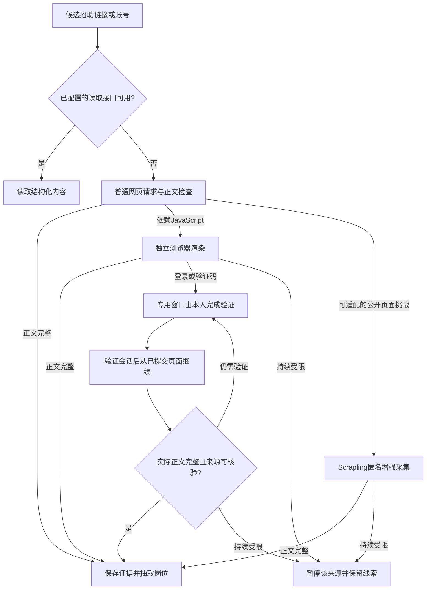

# 消防、机场及企业消防工程招聘扩源与证据核验设计

日期：2026-10-09

状态：用户于2026-10-09确认本书面设计，并再次明确加入公众号、微博的实际爬取。进入实施计划编写及审阅；尚未实施本次产品改造。

## 1. 使用目标与已确认范围

继续服务本人长期使用的求职工作台。在保留简历和目标版本隔离的前提下，扩大相关来源，让每次检索得到更多新鲜、不重复、有真实招聘证据且符合条件的岗位。

用户已确认：

- 国家大学生就业服务平台（NCSS/24365）纳入重点来源。
- 纳入机场集团、成员机场、航空保障企业及消防相关官方招聘。
- 纳入企业消防工程岗位，以及符合本人目标和实际资格的消防设计、施工、维保、安全管理、应急管理、EHS/HSE 等岗位。
- 公众号、微博增加实际正文采集与防爬适配。
- 公开内容可匿名采集；需要登录时，支持本人自行扫码或完成验证的独立采集窗口。专用会话与日常浏览器隔离。
- 同时升级来源扩充、实际采集覆盖和岗位证据核验。

沿用既有约束：目标保存独立简历副本；每个版本保留自己的岗位、检索、评价和投递；同版本保守去重；回收、恢复、永久删除及72小时清理覆盖子数据；操作成功有提示，失败有明确原因和诊断入口。采集请求使用通用岗位词和公开网址，不携带姓名、电话、完整简历等个人材料。模型使用当前已配置模型，10元为模型费用上限；新增搜索服务或社交接口的付费服务默认关闭，由本人另行开通。

本次成功标准是有效岗位及其证据增加，不以网址数量或搜索摘要数量代替岗位质量。

## 2. 已核查的基础与缺口

### 2.1 内置来源目录

| 类别             | 条目 | 标为 ready | 标为 candidate |
| ---------------- | ---: | ---------: | -------------: |
| 高校             |   30 |         20 |             10 |
| 企业             |   11 |          3 |              8 |
| 公共公告         |    6 |          6 |              0 |
| 平台、搜索及社交 |   10 |          1 |              9 |
| 合计             |   57 |         30 |             27 |

这是内置JSON目录的只读计数，未读取用户保存的自定义站点或本机账号。ready是目录状态，不能等同于当前在线成功。20个高校ready主要为江苏91job，6个公告ready主要为中科院机构，3个企业ready为腾讯、博世和Canonical；机场、企业消防工程、地方公共招聘覆盖不足。

注册器已有17个provider及 `collect/fetchDetail/probe` 契约。NCSS已有列表和详情适配器；微博为搜索线索，微信公众号当前运行路径主要返回搜索元数据。部分企业公告候选缺少必须的解析模板，不能计为已接通。

微信公众号同文件保留 `parseArticle` 正文解析函数，但当前 `collectWechat` 未调用；接入时可复用经验证的解析逻辑，不能因函数存在就计作已具备正文采集。微博当前 `authorization_required` 是适配器实现状态，不意味着所有公开博文均要求登录。

### 2.2 实际采集限制

当前标准/广覆盖分别为12/24站点、120/240请求；两者均为6关键词、每查询2页和20条详情补抓。20是补抓额度，不是岗位总数上限。规划、输入校验、统一分页层及legacy包装均有约束，仅修改一个配置字段无效。

选站缺少持久的跨运行轮换。公告适配器只读列表第一页，附件保存为 `not_extracted`；每次模型展开最多5篇公告。HTTP传输目前主要提供文本，附件二进制与表格解析需要新增能力。

现有HTTP调度器是内存限流器，回收站调度器只负责清理；尚无可恢复的持久采集队列。旧run的partial/interrupted是终态，不能直接交给定时器自动重跑。

## 3. 路线比较与采用方案

| 路线                                                                  | 收益                                                                   | 成本及边界                                   | 选择                     |
| --------------------------------------------------------------------- | ---------------------------------------------------------------------- | -------------------------------------------- | ------------------------ |
| 混合本地采集：现有Node请求、独立Electron浏览器、Scrapling公开页面增强 | 复用已有程序；覆盖公开接口、动态页面和本人授权会话；保留证据和本地控制 | 需要统一请求预算、浏览器隔离与增强运行时打包 | 采用                     |
| 只扩目录和请求参数                                                    | 改动较少                                                               | 正文、附件、固定选站和社交限制仍会阻碍覆盖   | 作为前述路线中的目录工作 |
| 以外部聚合数据服务为主要来源                                          | 可减少部分网站适配                                                     | 收费、覆盖范围、时效与证据质量依赖供应商     | 保留为后续可选接口       |

采用现有Node/Electron工作台加有限采集模块，不更换全部存储或另建云端简历系统。源码与用户级Scrapling技能分别管理；发行EXE需要独立可验证的运行文件，不能依赖开发机的Codex目录。

## 4. 来源范围与验证

### 4.1 来源优先级

1. NCSS职位、招聘公告及专场活动；机场集团、成员机场、地服、航油、航空工程等单位的官方招聘。
2. 消防设计、工程施工、检测维保、装备制造、建筑设计院、园区/物业及工业企业的相关岗位；按岗位实际职责和要求筛选，企业所属行业不替代岗位条件。
3. 消防救援机构、地方政府、国聘、公共招聘网及地方公共就业平台。
4. 民航、安全、消防相关高校就业网及可复用的高校/企业招聘系统租户。
5. 所选企业和机构的招聘公众号、微博账号；通用平台与公开搜索作为发现补充。

第一阶段目标是整理50–100个高相关候选站点，逐站验证后加入可运行集合。公布候选、已验证、正文受限及暂时失败的分别计数，不承诺候选全部可自动采集。

### 4.2 候选发现与探针

从官方单位名单、已确认官网、招聘栏目和公开Sitemap/RSS发现入口。单站发现深度最多2层、最多100个候选URL；优先已有91job、通用ATS或已验证公告模板。外部搜索结果和历史网页归档可用于发现，但当前招聘事实回到实际来源核实。

同平台扩站先核验学校代码、企业租户和对应主体，不能仅凭域名或相似路径复制配置。来源发现产生候选，不直接启用未经验证的站点。Common Crawl URL Index仅作按已选官方域名的有限入口发现，不引入全网归档下载或以历史快照判定正在招聘。

每个站点记录主体、来源种类、地域/岗位族、平台租户、招聘入口、解析版本、访问方式、最近列表/正文成功时间和验证证据。网站、账号昵称或页面标题不能独立证明官方身份；需要官网链接、可核验主体或平台认证证据。

probe分开报告列表、详情、日期、附件和投递入口能力。空列表允许报告成功但无样本；只有实际正文样本才能标为已验证正文能力。某一次403不能抹去历史成功，也不能被历史成功掩盖本次受限。

NCSS先核验当前公开页面实际使用的列表、分页、详情及域名重定向，再更新适配器。现有站内AJAX路径是已实现的页面配套请求，不宣称为有长期兼容保证的官方开放API。

## 5. 公众号、微博与防爬适配

### 5.1 获取顺序

普通请求负责HTML、JSON-LD及页面配套的公开数据。动态采集等待实际正文，读取正常页面加载取得的DOM或相关数据响应。Scrapling为匿名公开网页提供TLS/请求头一致性、会话保持、动态或stealth采集；每个URL同一轮最多一次增强升级。使用官方能力处理经验证适用的JS/浏览器挑战，不能将库的Cloudflare能力推断为微信、微博风控全部可解。

验证码、登录墙或会话失效进入 `challenge_required/login_required/session_expired`，由本人在专用窗口处理后再检查正文。HTTP200的验证页、登录壳和反爬说明页均不算成功正文。持续403暂停该来源，429按Retry-After恢复；网络错误/5xx最多2次退避重试。计数包括失败、重试和升级尝试。

### 5.2 微信公众号

- 输入已知公开文章链接、机构/企业公众号种子及通用招聘词，发现文章后按实际可达内容提取标题、发布主体、日期、正文、图片和原公告链接。
- 完整招聘正文或附件取得后进入岗位抽取；搜索摘要保留为线索。链接、种子名单和个人会话都不证明能够取得全部历史文章。
- 在目标企业官网、NCSS、高校就业网有同批公告时，保留来源关联并用原公告补全证据。
- 微信账号发布管理接口仅作为自身或运营方已授权公众号的可选读取通道；本轮未取得官方最新权限细则，不启用或承诺全平台发布列表接口。

### 5.3 微博

- 默认通过所选公开账号、公开搜索和独立浏览器获取招聘博文及其完整长文、图片和官方外链。
- 提供官方开放平台读取适配。官方CLI为 `@weibo-ai/weibo-cli`，须本人完成开发者认证、服务/额度和OAuth；启用前读取账号实际可用命令及参数，只开放读取能力。
- 接入探针使用 `doctor` 检查前提、`commands list --available` 查看账号实际能力、`commands show` 核对参数。官方页面索引可支持这条路线，本轮直接读取CLI页面未返回正文，未验证本机实时调用可用性；不把文档命中当作服务已接通。
- 官方API与专用网页会话是不同访问方式，显示各自能力和额度。网页可以浏览的内容不等于API拥有同等权限；搜索成功不代表全量历史。
- 长文标记只触发正文补取和完整性检查，不能证明已得到全文；平台返回的数量也不能当作去重后的可见帖子数。
- 只采所选来源的招聘发布内容。转发、重发和多平台镜像参与本版本的保守去重；原主体与招聘批次保留。

### 5.4 专用会话与程序边界

- 每个目标包、平台及所选登录账号使用专属会话标识和独立采集窗口，不跨目标包共享登录材料，不导入日常浏览器Cookie、微信聊天或私信。公开来源种子和工具文件可复用，岗位与会话私有状态独立保存。
- 远程网页运行在隔离的浏览器窗口：关闭Node能力，启用上下文隔离和沙箱；不加载工作台预加载桥接；导航、弹窗、下载及网络访问经过公开URL/域名校验。
- 本人登录后，会话仅供该平台采集。Scrapling匿名worker不接收登录Cookie或OAuth凭据。
- 默认会话仅在本次应用运行期间保存。本人勾选“记住采集登录”后，必要Cookie/OAuth材料通过系统加密保存；加密不可用时不持久化，给出提示。持久Cookie在启动时恢复到非持久的专用浏览器partition，避免产生未管理的明文凭据副本。
- 页面支持验证登录、清除登录和查看会话失效；密码及短信验证码由本人直接在平台页面输入。
- 登录材料、浏览器存储和运行时不进入业务备份、导出或诊断日志。目标包只保存匿名内部session引用，加密存储登记其目标包归属。归档中止并关闭该包采集窗口；恢复后按登录有效性重新验证。永久删除清除该包全部采集会话及登录材料；清除失败保留独立清理任务并提示，不能标为已完全清理。业务备份恢复只恢复空会话引用，需本人重新登录。

### 5.5 可信账号与招聘意图

社交账号池先验证机场、企业招聘、高校就业、人社和消防相关机构主体；官网链接优先，关键词搜索作为补充发现。先区分单位招聘、个人求职、培训广告、普通资讯和未知意图，再抽取岗位；未知进入线索待核验，不因为出现“消防”“机场”就生成推荐岗位。规则先判断，含混内容只在剩余模型预算内辅助分类，分类必须附正文证据。

一个公告可包含多个岗位，原帖子/文章ID、发布时间、更新时间、采集时间和外链共同保留。帖子发布日期不替代报名截止日期，账号所在地不替代工作地点。招聘海报、长文和官网外链用于补全；未取得完整内容时保留缺失原因。账号选定不等于可以完整取得该账号全部历史。

### 5.6 第三方工具的取舍

本期不将以下项目直接纳入发行依赖；借鉴边界如下，运行能力仍需单独验证：

| 项目                    | 已核对现状                                                               | 本项目使用方式                                                              |
| ----------------------- | ------------------------------------------------------------------------ | --------------------------------------------------------------------------- |
| wechat-article-exporter | 作者2026-07-30宣布所依赖上游核心接口关闭并停止维护；声明仅针对其依赖通道 | 研究解析、缓存和导出思路，不作为可用的一键同步入口                          |
| WeRSS的weread_mp模式    | 文档仅支持最新一篇、不能历史回补；正文失败后默认不会再次抓该条           | 参考订阅/增量组织方式，不据此保证完整账号历史；本项目对缺正文单独重试与核验 |
| weibo-crawler           | 文档提供账号/日期/关键词增量，关键词查询要求Cookie；本轮未运行           | 参考账号池与帖子ID管理，不读取日常浏览器Cookie或采集无关个人资料            |
| MediaCrawler            | 支持列表未含公众号；许可证限定非商业学习研究且禁止大规模采集             | 不作为本产品通用采集依赖；浏览器会话边界按本设计独立实现                    |

## 6. 采集活动、分批与断点续采

### 6.1 活动与运行分开

一次“开始检索”创建采集活动。活动状态嵌入本目标包的根run `collectionProgress`，状态为 `collecting/paused/waiting_for_auth/budget_exhausted/completed/cancelled`。每个有限批次或人工续采使用新的run，关联同一根活动；保留旧run终态语义。

根run标记 `collection_root`，只作为活动与累计数据的容器，其旧 `run.status` 固定为终态completed，不据此判断采集完成；批次run标记 `collection_slice`，继续使用既有运行状态。活动界面及busy判断读取 `collectionProgress.status` 和实际子run/lease；检索历史只按活动显示总结果，根容器不额外计作一次成功检索，费用不把根累计与子批次重复相加。新设活动级暂停、续采和取消入口，不能用会直接跳过终态run的旧取消方法取消根活动。锁内登记唯一活动子批次，重复点击续采返回同一执行结果，不能创建并行批次。

checkpoint包含计划版本、目录哈希、查询哈希、解析版本、epoch、进度revision、每个采集单元的下一页/游标、已提交页数和累计额度。游标属于私有业务存储，不能含登录材料或进入日志。请求词、地域或解析版本变化使对应游标失效，先暂停，再由本人确认更新计划；沿用同一根活动时累计额度保留。目标版本改变则新建该版本独立活动，不移用旧版本游标或私有缓存。

页记录与下一游标在同一个工作区事务提交，空页也提交。入库与进度更新前锁内检查准确scope、活动状态、取消标记、epoch、expectedRevision和有效collect lease。持久提交失败时不推进游标，下一次允许重放，依靠身份与观察记录去重避免重复保存。

增加 `commitCollectionPage` 服务，并从现有 `jobService.ingestRecords` 抽取纯入库mutation。身份判断、观察记录、目标成员关系、页记录、cursor及进度revision在同一draft内更新并一次提交；不能在checkpoint事务中再次调用自行开启事务的ingest API。provider增加可选 `collectPage/capabilities`，旧provider保留既有 `collect`；未迁移者明确显示不可断点续页。

每批重新申请collect lease，空闲、等待登录或暂停时释放。归档先在锁内暂停该包尚未结束的根活动并提高epoch，再中止子run，等待lease、浏览器和临时资源释放，最后归档；永久取消则将根活动标cancelled并提高epoch。恢复后可恢复的旧活动保持暂停，已完成和已明确取消的活动保留终态，由本人选择新建活动或续采。旧worker、旧epoch和迟到页面均不能写回；合法续采经锁内验证后使用新epoch重建请求，沿用已提交进度。永久删除、备份过滤和删除账本继续覆盖根run、子run及其checkpoint。

应用关闭期间不采集，重开后只恢复进度和提示，不自行发出查询或增加模型调用；本人点击续采后继续。周期刷新作为明确开关，默认关闭；开启后也需目标仍启用、包仍active、会话可用且额度尚足。

### 6.2 预算与公平覆盖

新活动采用下列产品默认值；它们是本地资源控制值，不是任何平台的官方许可或额度。已有目标的显式额度不被升级自动放大。

| 模式   | 活动最多站点 | 累计网络请求 | 每查询最多页 | 缺正文补抓 | 最多岗位词组 |
| ------ | -----------: | -----------: | -----------: | ---------: | -----------: |
| 标准   |           24 |          400 |            4 |        100 |            6 |
| 广覆盖 |           50 |         1000 |           10 |        300 |           12 |

站点数量是整个活动的上限，每批最多10站点。请求、详情、附件及浏览器额度按根活动累计，暂停/续采/重启不会重置；可向下调整，向上最高50站、2000请求、20页和600详情，界面与后端共用校验。

网络或附件额度耗尽时暂停相关采集单元。本人可在暂停状态显式调整活动资源额度，再按原累计消耗续采；调整前显示已用量、新上限和未完成范围，不重置计数或模型费用。模型额度耗尽只停止付费处理，剩余公开采集和规则评价可在资源额度允许时继续；完成后显示“模型评价部分回退”。已完成/取消活动不能借续采重开，需本人明确创建新活动；周期刷新沿用当前根活动累计预算，不能自动创建新的付费额度。

网络、模型及worker发起外部调用前，在根活动中以唯一reservationId持久预约请求、费用或批次上界，再实际发送并结算。现有模型预算仅有内存计数，本次新增持久预约账本；重启后未结算预约仍保守占用，子run只能领取根活动剩余额度。原子页提交不会替代调用前预约，避免“请求已收费、页未提交时崩溃”丢失消耗。

先让每个入选站点执行一轮，再按岗位相关性、更新规律、待补正文和健康状态继续分页。本目标各活动保留来源轮换游标；轮换只能使用已验证、已选且未禁用的来源。数据源失败不会阻断其他来源。达到额度标为部分覆盖，并列出未执行及未完成的单元。

目标内保存已见岗位ID/URL、正文变化率、上次成功和下次应检查时间，支持条件请求和内容指纹复用。选站先对到期来源按距上次检查时间轮换，再分配补抓，防止高评分来源长期挤掉其他已选站点。Sitemap lastmod和RSS只作为变化提示，正文与截止信息仍需实际核验；只在应用运行且本人开启周期刷新时按到期时间执行。

普通请求复用限流基础；社交页面初始单域名并发1、页面间隔3秒，浏览器全局并发最多2。Retry-After优先，持续限制暂停，不通过重复并发请求压过风控。

按近期正常响应耗时和失败率逐步加大间隔；错误响应较快不能因此提速。借鉴Crawlee的并发/速率分开控制及Scrapy AutoThrottle思路，复用现有调度服务，本期不叠加两个新的爬虫框架。

浏览器和Python自动采集请求也经过预算控制：文档、XHR/API、静态资源、附件、重定向及重试均计入累计网络额度；浏览器资源另受每页60请求/20MiB上限约束，排除不需要的广告、视频、音频。请求类型单独统计，避免把正文请求与资源请求混淆。招聘图片按附件路径单独读取，不能因资源拦截丢失图片里的招聘条件。worker请求额度先预约，不能确定实际消耗的失败按预约上界结算。本人在登录窗口直接执行的交互流量另行计数和限流，不归为采集成果；登录结束后的自动正文验证回到活动预算。

每活动附件最多40份，单份20MiB，总下载200MiB；能力支持者使用ETag/Last-Modified。304仍计检查请求；正文指纹未变则复用解析，不重复模型处理。配额结束后保留下一游标和未完成原因，不声称全量覆盖。

模型10元上限由同一根活动共享，分批和续采不产生新的10元额度。先规则筛选、复用本版本缓存，再按剩余额度精评候选；自动续采不自动重置模型费用。费用不确定的调用保守占用额度，沿用现有费用上界算法并接入新增持久预约账本。

## 7. 正文、附件和岗位证据

优先使用当前页面的JobPosting/JSON字段，再提取HTML正文、附件和必要的招聘图片。页面字段与可见正文冲突时保留冲突，不能用结构化标记覆盖实际要求。

附件服务增加bytes传输，检查大小、MIME和文件签名：文字PDF直接提取并保留页码；DOCX保留段落和表格；XLS/XLSX读取工作表、合并单元格及行列；扫描PDF/图片通过本地OCR增强能力识别并保留图像位置。DOC采用隔离的本地转换能力；运行时缺少DOC转换或OCR时明确标为附件待解析，提供原链接和手工导入，不生成已核实岗位。

原附件和图片尽量在内存读取，提取出的文本、表格和字段证据存入所属版本记录。不长期保存原二进制；转换确需临时文件时使用单次受控目录，先在独立持久清理清单登记packageId、activityId、attemptId及受控相对路径，再创建文件。清单不含正文、原网址或个人文件名，不进入业务备份；启动恢复、结束、取消、归档及永久删除均执行清理。删除失败保留 `cleanup_pending` 和重试清单，不能删除包后丢失清理依据或声称完全清理。清理服务只能操作登记且解析后仍位于应用临时根目录的路径；临时材料、日志和worker输出不进入业务备份。

招聘公告拆成具体岗位时，处理公告共用条件、岗位行特定条件和页续表关系。每个字段关联正文片段或附件页码/表格单元格；无法确定哪行对应哪个岗位时标为待核验。解析低置信度和缺失字段保持未知。

保存 `sourceEvidence`、最近核验时间、招聘批次、正文哈希和解析版本；正文属于岗位证据，诊断日志不保存正文。搜索摘要、标题匹配、HTTP200和大模型推断均不能单独形成已核实岗位。

## 8. 企业消防岗位的资格与推荐

使用本目标的独立简历副本和已确认的校正事实，增加专业、证书等级/注册有效状态、学历、毕业届次、正式经验及岗位明确要求的资格判断。国家消防员、政府专职消防员、企业消防工程技术岗单独标记，体能/年龄等只在岗位有明确要求时判断。

| 状态     | 判断                                       | 展示                       |
| -------- | ------------------------------------------ | -------------------------- |
| 符合条件 | 有证据表明满足全部已识别必需条件           | 可进入推荐候选             |
| 待核验   | 岗位条件、本人事实、OCR或来源存在缺失/冲突 | 单独列表，说明缺少哪项信息 |
| 不符合   | 明确必需条件与本人已确认事实冲突           | 说明原因，可在筛选中查看   |

“优先/有则更好”不作为淘汰条件；标题“工程师”不代表必须持证或多年经验。实习、项目经历不自动折算正式工作年限。专业范围、或关系及替代资格按正文解释，无法确定时unknown。AI分数不能覆盖硬条件失败或把unknown变为已满足。

推荐还需正文已核验、招聘有效且有投递证据。过期/关闭/拟录用公示保留为历史，日期不明或投递入口无法确认进入待核验。投递需登录与入口失效分别显示。长期招聘须有来源明确表述并在最近72小时验证入口；不能因为未写截止日期就默认长期有效。

## 9. 去重、隔离和数据生命周期

在现有权威ID、规范URL、内容/业务指纹和冲突判定上扩展。每个版本内部将同岗位的多来源证据关联，保留发布主体、批次、城市和资格要求。

公司+标题相同不够判为重复；不同招聘批次、地点、合同性质、专业或证书要求存在冲突时不自动合并。近似文本/SimHash仅筛出疑似重复，再做岗位事实比较；证据相互矛盾进入冲突待核验。

根活动、子run、抽取正文、评价及投递均归属同一目标包。全版本去重继续逐版本执行；不同目标的同一公开岗位各自保留，个人评价和投递不共享。带查询/画像信息的checkpoint不放入全局settings或sourceHealth。

schema3增加可选run进度及证据扩展，历史记录默认无进度且不自动重跑。跨记录的根run引用纳入归属校验；备份、旧版归一化、恢复、导出、归档和清理均覆盖新增字段。全球运行时及匿名站点健康只保存工具状态或公开运行事实，不保存目标画像。

## 10. 用户界面与诊断

沿用已有shadcn界面和九页导航：

- 来源页增加行业分类、主体/账号、列表/正文/附件能力、最近验证、访问方式、会话状态及验证/清除登录入口。
- 当前活动显示计划/实际站点、已提交页、未覆盖原因、剩余额度、正文与附件进度；支持暂停、继续和取消整个活动。
- 岗位库增加符合条件/待核验/不符合及当前/历史招聘筛选；岗位详情展示条件原文、出处、核验时间和多来源证据。
- 登录/验证码在专用窗口完成后，工作台显示实际验证结果，不能仅凭窗口关闭提示成功。
- 每次保存配置、验证、登录材料清除、暂停、续采、取消和核验校正均有成功提示；失败保留输入和进度，提供错误编号及下一步。

日志沿用白名单，增加采集活动/单元内部ID、engine、页序号、阶段计数、缓存命中、流量、耗时、HTTP状态和固定错误码。按计划→发现→正文→附件→资格→去重→推荐统计每一步损失和原因。禁止记录个人材料、原查询词、原URL参数、Cookie、OAuth Token、游标、网页正文及worker原始stderr；内部source/site标识也必须经过固定枚举或安全ID处理。

## 11. 运行时、打包与故障处理

Node请求与Electron专用浏览器作为默认能力。Scrapling使用独立匿名worker和受控JSON协议，输入只包含按provider允许的路由和公开参数重建的网址、限定提取规则、预约额度及取消信息。禁止传入专用会话网址、登录/OAuth回跳、临时签名或含凭据的query/hash；需要这些材料的读取留在专用授权浏览器。worker不继承模型/搜索密钥环境变量，不通过shell执行网页返回的指令，不接受任意Python或JavaScript代码作为提取规则。

交给模型的页面按正文范围净化，清除脚本、隐藏指令和无关内容；若使用Scrapling CLI，显式启用 `--ai-targeted`，库模式实现对应正文净化。网页文本始终是待抽取数据，不能指示程序修改配置、读取本地文件或发送材料。原招聘表格与字段证据保留，净化不能删除岗位必需条件。

完整桌面发行包含经过锁定、许可证和哈希清单验证的增强Python/浏览器运行文件，后台进程隐藏运行；独立登录窗口仅在本人点击后显示。启用前做能力探针；增强运行时不可用时来源保留为受限并显示修复动作，普通网页和独立Electron采集仍可用。依赖版本在实施时根据兼容验证锁定，不把当前用户级工具路径写入产品。

网站结构改变、权限不足、worker崩溃、附件不可解析、配额不足和用户取消分别报告。进程崩溃从最近已提交页恢复，未确定消耗的预算保守结算。浏览器内部请求也执行公开URL、跳转与DNS安全检查；不能访问本机工作台服务、内网或任意文件。浏览器任务结束关闭其页面并回收资源，等待登录不占用其他来源的采集槽位。

## 12. 验收与实施分组

同一份实施计划按依赖顺序分组：

1. 持久活动/预算/取消保护、统一分页和bytes传输。
2. NCSS、机场及企业消防相关源验证扩充，公平轮换与增量采集。
3. 独立浏览器/会话、Scrapling增强及公众号微博正文采集。
4. 附件与字段证据、资格三态、时效和投递核验。
5. 来源/进度/岗位界面、诊断、隔离/恢复/清理及EXE验证。

硬门槛：

- 合成分页含空页、重放、崩溃、查询改变、取消、归档→恢复及永久删除，证明不丢页、不重复保存、不越包写回、不复活取消活动。
- 预算跨批次与重启累计，网络/浏览器/附件/模型费用均有门槛；模型费用不超过本人已授权上限。
- 公众号/微博fixture含真实正文结构、动态壳、登录、HTTP200验证码、429、403、会话失效和重发内容，失败必须保留状态且不计为正文成功。
- 附件样本含PDF、DOCX、XLS/XLSX、多页表格、扫描件低置信度及不支持的DOC；字段与原文行/页对应。已配置增强能力须通过其专门样本，缺少能力必须明确降级。
- 企业消防岗位样本覆盖证书必需/优先、专业或关系、校招/社招、正式经验、缺信息和过期；未知或明确不符合不得显示“已符合全部条件”。
- 每种已启用来源实际小样本探针验证列表、正文、日期及投递证据；平台限制造成不能验证时保留受限，不用合成通过替代线上成功。
- 完整离线、React、版本隔离、回收/永久清理、备份恢复及真实EXE三种DPI门槛；发行包排除个人数据和凭据，增强运行时可在无开发机Python/Node环境启动。

报告同时统计每100次自动采集网络请求新增的有效且不重复岗位、已执行来源覆盖、正文/投递入口完整率、待核验与过期占比、重复及误合并率。请求分母包括失败、重试、重定向、静态资源、附件和304，缓存无网络读取不计请求；另列正文/API请求与资源流量，人工登录交互单列。新增有效岗位须本版本此前未有、正文和当前招聘已核验、必需资格已满足且有投递证据；旧岗位刷新或镜像补全不重复算新增。

指标按阶段和来源类型展示。每轮实际验证从新岗位、待核验、过期和疑似重复中各抽最多10条人工复核，不足时全部检查；记录错误字段及原文位置并加入回归样本，发现误合并先暂停相应自动合并规则。线上收益使用同样词组、候选范围和预算口径对比实测，不以模拟数据或扩大原始条目数宣称质量提高。

社交接入先做最多20个已核验机构账号、最近7天公开内容的试点，对可取得的100–200条内容人工核对（不足时全部核对），包含招聘、求职和培训等负例。该试点尚未执行，不自行启动连续7天采集。检查招聘意图、岗位字段、官网核验率和每100请求新增有效岗位；漏采仅相对于人工建立的可见参考样本，受限或缺历史的账号明确列出，不能宣称全平台召回率。所有试点仍受同一活动资源与10元模型预算约束。

## 13. 资料核验与结论边界

官方资料核验日期：2026-10-09。未运行真实批量采集、未登录、未使用凭据或用户简历。

- [NCSS职位页面](https://xyzy.ncss.cn/student/jobs/index.html)：已读公开页面；已有adapter协议仍需实施前在线小样本核验。
- [Scrapling官方项目](https://github.com/D4Vinci/Scrapling)：已核实请求、会话和浏览器增强能力；未验证微信/微博所有风控可解。
- [微博官方CLI手册](https://open.weibo.com/cli/quickstart)：官方搜索索引可读（约两周前抓取），支持认证、服务、OAuth及能力发现流程；本轮直接读取未返回正文，实时网络/账号调用及可用额度需接入时核验。
- [微博开放平台发布的搜索说明](https://www.sina.cn/news/detail/5321248944168192.html)：支持公开微博发现，未证明全量历史可读。
- [微信发布列表官方文档入口](https://developers.weixin.qq.com/doc/offiaccount/Publish/Get_publication_records.html)：本轮读取受限，最新权限细则未核实；本设计不以该接口保证任意公众号采集。
- [JobPosting结构化数据](https://developers.google.com/search/docs/appearance/structured-data/job-posting)：用于字段发现，须与页面实际招聘内容对照。
- [HTTP条件请求RFC9110](https://www.rfc-editor.org/rfc/rfc9110.html#name-if-none-match)：用于条件检查及减少重复正文下载，不能省略请求计数。
- [Cedefop与Eurostat招聘数据研究全文](https://www.cedefop.europa.eu/files/5610_en.pdf)：已核对第2、3章，采用来源相关性/稳定性/字段完整性评估、同岗位证据补全后去重及规则/人工样本验证；不照搬欧洲行业分布或统计去重规则。
- [Sitemap协议](https://www.sitemaps.org/protocol.html)与[Common Crawl URL Index](https://index.commoncrawl.org/)：前者辅助发现和增量提示，后者仅作有限历史入口发现；二者均不能独立证明岗位仍在招。
- [Crawlee并发与速率管理](https://crawlee.dev/js/docs/guides/scaling-crawlers)与[Scrapy AutoThrottle](https://docs.scrapy.org/en/latest/topics/autothrottle.html)：采用分开控制并发/速率及错误不提速的调度原则；未引入这两个框架作为产品依赖。
- [wechat-article-exporter停止维护说明](https://github.com/wechat-article/wechat-article-exporter/issues/200)、[WeRSS weread_mp模式说明](https://github.com/rachelos/we-mp-rss/blob/main/docs/weread-mp.md)、[weibo-crawler文档](https://github.com/dataabc/weibo-crawler)及[MediaCrawler许可证](https://github.com/NanmiCoder/MediaCrawler/blob/main/LICENSE)：已核对项目声明或文档，不代表本机现场运行成功。
- [ICWSM2024社交招聘研究](https://sel.sise.bgu.ac.il/assets/pubs/job-vacancies-icwsm-2024.pdf)：采用招聘意图分类、职业/地点抽取和人工抽样验证思路；URL辅助去重不等于论文验证了外链全文提取，追踪原公告属于本项目设计选择。
- [JMIR2024指定公众号内容研究](https://www.jmir.org/2024/1/e55937/)：借鉴机构背景来源池、编码规则及分歧复核；机构背景不能独立证明官方身份，不照搬删除图片/短文规则，以免丢失招聘海报。

### 13.1 补充研究的采用方式

| 补充方法                                | 本项目决定                                                                                 | 实施位置     |
| --------------------------------------- | ------------------------------------------------------------------------------------------ | ------------ |
| 来源自动发现、Sitemap/RSS、同平台扩租户 | 采用；先验证主体与实际正文，再启用                                                         | 第4节        |
| 跨运行轮换、增量刷新、持久分页          | 优先采用；累计预算、预约和取消保护一起实施                                                 | 第6节        |
| PDF/DOCX/表格/OCR附件提取               | 采用分层解析；低置信度或缺能力保持待核验                                                   | 第7节        |
| 跨网站证据补全、保守去重                | 采用；权威身份先确认，批次和资格冲突阻止合并                                               | 第9节        |
| SimHash及主题爬取论文                   | 借鉴候选筛选思路；具体阈值根据岗位样本验证，不照搬网页删除策略                             | 第4、9、12节 |
| Crawlee、Scrapy动态调度                 | 借鉴方法，复用现有服务；本期不引入平行框架                                                 | 第6节        |
| Common Crawl历史归档                    | 仅用于公开入口发现，当前招聘回官网验证                                                     | 第4节        |
| PaddleOCR-VL技术报告及通用准确率        | 作为OCR候选资料，实施时核对运行成本/许可证及招聘表字段准确率；不将论文分数写为本产品准确率 | 第7、12节    |

社交补充研究中的招聘意图分类、机构账号池与人工样本复核纳入第5、12节，建立中文招聘/求职/培训等正负例；原公告补全和官方身份另行核验。

补充研究摘要中的来源发现、刷新策略、附件解析及候选去重方法已纳入。论文和第三方项目的通用实验指标不作为本项目招聘字段准确率或岗位质量的实测结果。
