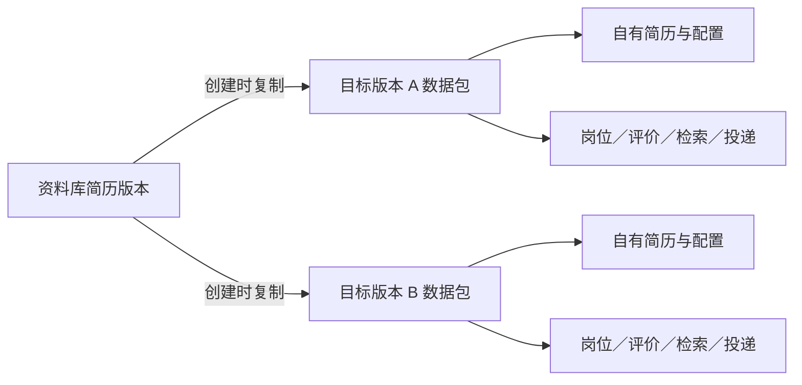
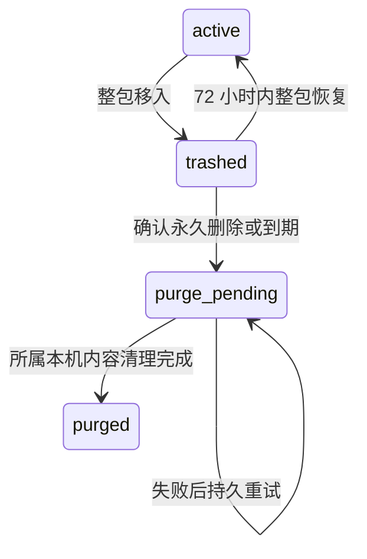

# 求职工作台界面、版本隔离与回收站设计

日期：2026-10-09

状态：用户于 2026-10-09 审阅通过；已编写实施计划，实施计划待审阅，尚未开始本次产品实现。

设计依据：用户已确认采用 shadcn 与 UI UX Pro Max，并确认目标保存独立简历副本、版本子数据隔离及整包回收删除的方向。

## 1. 使用目标与已确认规则

面向本人长期使用的求职工作台。用户应能立即找到当前求职目标、岗位、投递状态及下一步操作，并准确知道一条记录属于哪个版本。

用户明确要求：

- 使用真正的 shadcn 组件改善界面，结合 UI UX Pro Max 的布局与交互指导。
- 简历和目标版本相互隔离，所属岗位、评价、检索及投递记录随所属版本管理。
- 目标保存时复制简历；资料库中的原简历被回收或删除，不影响已经独立保存的目标。
- 版本进入回收站时，子数据一起进入；恢复时一起恢复；永久删除、清空或满三天时一起删除。
- 同一版本内部的重复岗位应清理；不同版本的同一岗位各自保留。全版本清理遍历全部版本，逐版本执行。
- 每个版本支持自定义名称，同种版本的名称不可重复，回收站内的名称仍占用；永久删除完成后释放名称。
- 成功操作均有可见提示；错误说明原因与可执行的处理办法。

本设计替代 2026-10-08 设计中“跨版本共用个人投递”“引用非零阻止版本永久删除”“跨版本归并个人记录”的规则。原有隐私保护、输入验证、原子保存、准确版本事实、模型预算和诊断能力继续作为约束。

## 2. 当前问题与设计选择

### 2.1 已核查的问题

- `public/` 使用原生 JavaScript DOM 前端，没有 React、Tailwind 和 shadcn 项目配置。
- “简历与目标”同时展示导入、校正、创建目标和版本管理；“数据源与设置”同时展示来源、模型、目录、备份和日志。
- `job-service.mjs` 的投递按全局岗位 ID 保存；按目标筛选后仍共用投递状态。岗位详情也会返回其他版本的观察和评价。
- 目标仅引用资料库简历，运行和评分依赖该原简历；回收站只有版本归档标记，缺少独立页面、批量清空和到期清理。
- 当前运行文件和备份保存业务正文。仅从主 JSON 删除版本不足以完成本机的永久清理。

### 2.2 方案比较与选定路线

| 路线 | 收益 | 代价 | 结论 |
|---|---|---|---|
| React + shadcn；现有 JSON 存储按版本明确所有权 | 统一组件和交互，沿用原子事务与桌面后端 | 需要前端构建、数据迁移和接口改造 | 采用 |
| React + shadcn；每版本独立数据库或主文件 | 文件边界直观 | 批量迁移、备份和多文件事务更复杂 | 本次不采用 |
| 原前端继续运行，逐页嵌入 React | 可以分批替换 | 过渡期有两套状态和组件规则 | 仅可作为实施中的短暂过渡，交付时统一新界面 |

保持 Node.js 服务、Electron、安全桥接和招聘来源适配器。渲染层采用 React、TypeScript、Vite、Tailwind 和官方 shadcn Base UI 组件。具体依赖版本在实施时按官方兼容要求核实并锁定；本设计不依赖未经 CLI 验证的 preset 编码。

## 3. 导航与页面职责

主页面保留根 URL `/`，使用 Hash 路由，使浏览器、桌面桥接和深链接保持一致。

| 分组 | 页面与路由 | 页面主要动作 |
|---|---|---|
| 日常求职 | 工作台 `#/workbench` | 更新当前目标岗位；查看进度、结果和下一步 |
| 日常求职 | 岗位库 `#/jobs` | 筛选岗位、查看依据、记录投递 |
| 日常求职 | 投递进度 `#/applications` | 更新状态、安排跟进 |
| 求职准备 | 简历管理 `#/profiles` | 导入、校正并保存独立简历版本 |
| 求职准备 | 求职目标 `#/targets` | 新建目标版本、查看其自有简历和设置 |
| 求职准备 | 招聘来源 `#/sources` | 查看来源状态、启停和配置 |
| 系统管理 | 运行日志 `#/logs` | 查看检索过程、错误和脱敏诊断 |
| 系统管理 | 回收站 `#/trash` | 整包恢复、永久删除或清空 |
| 系统管理 | 设置 `#/settings` | 模型预算、目录、备份和版本维护 |

侧栏分组常驻，回收站显示包数量。窄窗口使用可关闭的导航侧栏，避免横向滚动隐藏菜单。旧 `#/profiles` 进入简历管理；原页的目标操作通过明确链接进入 `#/targets`。旧设置入口保留，新来源与日志入口有独立链接。

### 3.1 统一版本上下文

工作台、岗位库、投递进度和业务日志共用当前目标版本。页头显示“目标名称 / 使用的简历副本”，技术 ID 放入详情。路由查询参数保存精确 `targetRevisionId`，刷新、返回和分享内部深链接均保留上下文。

- 所有业务请求带准确包与版本身份，服务端校验二者一致，不能只靠前端筛选。
- “全部目标”提供只读汇总，每行标明所属版本，进入该版本后才能修改记录。
- 汇总不把同岗位不同版本的状态合成一条，不选用其他版本的最新分数。
- 设置中的“清理所有版本重复岗位”是明确的管理操作，不受普通汇总只读规则阻止。
- 切换版本时终止旧请求和事件流；迟到响应不能覆盖新版本。取消选择不自动创建版本。
- 当前版本被回收后清除其选择，提示“该版本已进入回收站”，返回可用版本选择或空状态。

### 3.2 各页具体布局

**工作台**：上方为版本和一次主要操作“更新岗位”；下方依次显示运行进度、结果摘要和当前版本推荐岗位。首次使用显示“导入简历 → 创建目标 → 更新岗位”的准备进度。规则/模型、预算和临时 Key 收入运行选项；Key 仅模型模式出现。检索历史链接到日志页，故障可以直接打开对应诊断。

**岗位库**：常用筛选为目标、搜索、推荐状态和投递状态；城市、来源、类型、资格及时间位于“更多筛选”。来源显示名称而不是要求输入 ID。默认表格列为岗位/单位、城市、推荐/匹配、资格、截止时间、投递状态和操作。默认每页 25 条，可选 50/100 条，显示筛选后总数；搜索采用 250ms 防抖和旧请求取消。打开详情侧栏后显示版本原文、评价依据、来源链接和本版本投递。窄窗口改为相同信息的卡片，不让整页横向溢出。去重和导入为次要操作。

**投递进度**：保留看板与列表，用有选中语义的切换组件；只显示当前版本的状态、备注和跟进日期。编辑使用侧栏，标题包含所属版本。任何拖动动作都提供按钮和键盘替代。

**简历管理**：默认展示资料库版本；“导入简历”按上传/粘贴、校正、命名保存逐步进行。字段有标签、说明及错误。导入失败保留输入。删除资料库版本时提示“已保存目标中的独立副本保持可用”，并展示该资料库包真正所属的子数据数量。

**求职目标**：默认展示可用和停用版本，操作为新建、查看、重命名、启停和移入回收站。创建分为选择简历、岗位偏好、来源与预算三个步骤，保存前提供摘要。创建时复制完整简历正文、画像和修正信息；新目标包默认没有旧目标的岗位、评价、检索和投递记录。修改业务配置通过新版本完成，原版本不被覆盖。

**招聘来源**：展示来源名称、类型、状态、最近成功/失败和当前启停；点击行查看诊断。新增站点在弹窗内完成，必要技术字段有说明。每次保存和启停都反馈结果，失败保留草稿。

**运行日志**：默认展示当前版本检索历史与运行阶段；另设“系统诊断”页签展示脱敏的请求、存储和清理过程。业务历史属于版本子集，永久删除后移除；系统诊断仅保留白名单技术状态、计数和错误码，不保留个人正文、版本名称、关键词、凭据或私人路径。

**设置**：使用“模型与预算 / 数据与备份 / 版本维护”页签。目录操作继续走固定 Electron 桥接。模型配置沿用用户当前 v4.1 与预算设置；金额以元填写与展示，10 元上限、0 元校验、规则模式不发 Key 纳入回归。版本维护包含全版本去重和待归属旧数据入口。

## 4. 视觉与交互规范

UI UX Pro Max 已实际生成系统建议并查询招聘产品、shadcn 侧栏/表格、错误汇总、焦点与删除确认规则。产品匹配为 Job Board/Recruitment，采用平面、极简、专业蓝与中性背景。自动建议的营销 landing pattern 不适合此工作台，页面结构由第 3 节定义。

| 项目 | 规范 |
|---|---|
| 背景与表面 | 浅灰背景、白色内容表面；避免装饰性渐变和大面积阴影 |
| 主色 | 专业蓝；绿色表示成功，红色只用于危险或错误；状态必须同时有文字 |
| 字体 | 本地系统中文字体，正文 16px，次要信息至少 13px；不依赖外部字体请求 |
| 间距 | 4/8px 节奏，页面区块 24px，组件组 16px，行内 8px |
| 主次操作 | 每页一个主要动作，次要动作使用 outline/secondary，低频操作进入菜单 |
| 操作目标 | 主要按钮至少 44px 高；紧凑控件的可点击区域与间距仍满足键盘和指针可用性 |
| 动效 | 150–200ms 的轻量状态反馈，尊重减少动态效果；不做列表入场或滚动动画 |
| 布局 | 在 375、768、1024、1440px 及 Windows 125%/150% 缩放下核查 |

语义变量初始值如下，实施时结合实际组件测量对比度：

| 语义 | 初始值 |
|---|---|
| background / foreground | `#F8FAFC` / `#0F172A` |
| card / card-foreground | `#FFFFFF` / `#0F172A` |
| primary / primary-foreground | `#0369A1` / `#FFFFFF` |
| muted / muted-foreground | `#F1F5F9` / `#475569` |
| border | `#E2E8F0`，可交互控件另有明确边界与焦点 |
| destructive / destructive-foreground | `#B91C1C` / `#FFFFFF` |
| success / success-surface | `#166534` / `#F0FDF4` |
| warning / warning-surface | `#92400E` / `#FFFBEB` |
| ring | `#0369A1` |

组件通过语义 token 和正式 variant 使用主题；不在各页堆叠颜色覆盖。正文和状态文字对比度至少 4.5:1，焦点可见。优先交付统一浅色主题，不引入额外主题设置。

官方组件分工：SidebarProvider/Sidebar 分组导航；Table/Card/Badge 展示数据；Tabs/ToggleGroup 切换；FieldGroup/Field/FieldError 表单；Sheet 详情与编辑；Dialog 多步骤创建；AlertDialog 不可逆操作；DropdownMenu 低频动作；Alert、Empty、Skeleton、Spinner 和 Base Toast 提供反馈。

实施前通过 `shadcn info/docs/search` 读取真实配置，从官方 registry 添加源码，核查生成组件和 Base UI 类型。不能照搬 Radix 的 props。导航保留原生链接语义；每个 Sheet/Dialog 有标题、可见关闭、焦点约束和关闭后焦点返回。只使用一套 SVG 图标，初始化确定为 Lucide 并通过实际配置核查。

表单提交失败：保留草稿，在字段旁显示错误，顶部提供可聚焦、可跳转的错误汇总。写入完成才显示成功 Toast；读取刷新不覆盖刚发生的反馈。忙碌时禁重复提交并说明正在处理；长任务显示阶段和计数。接口错误展示安全说明、错误码和诊断编号，技术细节可展开。

## 5. 版本数据包及所有权

### 5.1 数据包模型

每个包有永久不复用的 UUID `packageId`，与版本技术 ID 关联。种类为资料库简历 `profile`、目标 `target`，以及迁移用的 `legacy_unassigned`。每个私有记录恰有一个 `ownerPackageId`，并有稳定、不复用的随机 `recordId`；事件、附件和私有快照同样拥有记录身份。

| 包 | 拥有的内容 |
|---|---|
| 简历资料库包 | 简历正文、结构化画像、人工修正、导入信息及可确认直接属于该包的旧子记录 |
| 目标包 | 目标配置、完整独立简历副本、岗位实例、观察、评价、检索任务、投递及事件、运行文件 |
| 待归属旧数据包 | 不能可靠确定目标或简历所有者的旧个人记录与其必要内容，提供查看、分配和整包回收 |

源简历的 ID 是来源说明，不能成为目标运行的依赖。目标自己的简历副本随目标回收和删除；它不属于已删除资料库简历的保留历史。

### 5.2 存储与接口边界

继续使用现有 JSON 原子存储和全工作区锁。主文件固定路径 `workspace.v2.json` 保留，内容格式升级为 `schemaVersion: 3`，并增加包和所有权约束；旧程序遇到新格式拒绝修改。API 路径可保持 `/api/v2`，新增显式包范围。

- 包登记包含 kind、versionId、名称、启停、状态、归档次数 UUID、归档时间与到期时间。
- 现有集合按包归属改造；同一公开岗位在不同包中生成独立岗位实例 ID。投递使用独立 application ID，不再以全局岗位 ID 充当唯一身份。
- 包内记录和业务引用必须落在同一包；跨包只允许来源说明以及已核实的公开内容摘要，不允许共享投递、事件、评价或运行对象。
- 目标内的投递简历绑定只指向本包的自有简历。普通编辑不把其他资料库版本直接绑入该包；更换求职方案通过创建独立的新目标版本完成。
- 公开来源目录和适配器设置可全局使用。公开岗位身份用于查重，但岗位正文依据、个人采集关联和记录在各包内独立保存；本次不新增共享岗位正文池。
- 所有查询、详情、评分历史、检索事件、导入、导出、投递编辑和运行文件读取统一进行包校验。无包参数的旧写入接口只在身份唯一且可核实时转换，否则拒绝并要求选择版本。
- 全部目标汇总由服务端构建带归属的只读结果；不能先聚合个人记录再猜所属版本。
- CLI、V1 兼容入口和旧文件读取也经过相同所有权与删除检查；无法可靠适配的个人业务入口明确拒绝，不能绕回全局旧存储。

## 6. 去重规则

沿用已核查的保守岗位身份判断，但候选组严格限定在一个包内。不同岗位类型、单位、岗位名、城市、届别、批次、年份、招聘类型、资格和正文冲突均阻止确认重复；权威岗位身份、具体详情 URL 或充分一致的正文可提供确认依据。

- A 版本同一岗位三条合并为一条，B 版本同岗位独立保留。
- 包内合并保留来源依据、评价历史、投递事件及旧实例重定向，不跨包借用状态、备注或分数。
- 存在相互冲突的人工记录时保留并提示处理，不能覆盖人工记录或宣称全部清理完成。
- “清理所有版本”预览全部可见包，逐包生成计划和结果，包含停用及尚未到期的回收站包。回收站包的去重不改变其到期时间。
- 已到期或清理中的包交由回收站清理。专用管理接口可对尚未到期的回收站包去重，执行前和提交时校验修订、归档次数与期限；不能恢复包、延长期限或跨包合并。待归属旧数据包单独统计，不猜测合并入目标。
- 预览显示包名称、保留/合并项、依据和保护项；修订变化使旧预览失效，需刷新。全版本报告汇总逐包结果。

## 7. 回收站与三天保留

### 7.1 状态与时间

`enabled` 与包状态分开。停用目标仍属正常包，不进入回收站；恢复保留移入前的启停状态。归档写入新的归档次数 UUID、UTC 时间及 `purgeAt = archivedAt + 72h`；重复归档不重置时间。恢复清空期限；恢复后再次移入重新计时。

满 72 小时后恢复接口拒绝恢复，即使文件清理尚未完成。到期裁决与恢复在同一锁内检查包状态、归档次数和时间，不能用旧预览删除刚恢复又重新归档的包。

运行期间每五分钟检查；启动先恢复死亡进程租约和中断运行，再补清理。应用关闭期间不执行进程内任务，下次启动补清理。以存储的 UTC 截止时间计时，不按页面打开时间或自然日计算。

### 7.2 页面与操作

回收站提供“全部 / 目标版本 / 简历版本 / 待归属旧数据”分类、搜索与按删除时间排序。未到期行显示名称、类型、删除时间、到期时间、剩余时长、岗位/评价/检索/投递数量及状态。能力按状态区分：

| 状态 | 展示与操作 |
|---|---|
| 未到期 `trashed` | 可只读展开正文、整包恢复、永久删除 |
| 已到期、尚待登记清理 | 仅展示管理元数据与计数，不能展开正文或恢复；显示“已到期，等待清理” |
| `purge_pending` | 展示匿名操作编号、安全计数、进度和重试原因；不展开正文、不恢复，不依赖已删名称 |
| `purged` | 不留普通回收站行；系统诊断只记录匿名技术结果 |

恢复、单项永久删除和清空均操作整个包。清空只处理当前回收站包，不删除可用或停用包；页面筛选不改变“清空整个回收站”的范围。确认窗口展示准确包数及子记录数，并提供“取消”。

服务端预览返回工作区修订和归档次数；确认执行时重读。新增包或归档状态改变使预览失效，不能悄悄扩大删除范围。按钮操作中禁重复点击，批量结果分别显示完成、处理中和失败项。

移入前检查本包活动操作。有活动检索/评分时提示用户先取消或等待，不报告归档成功。单击“取消并移入”可发起取消，但必须等待所属操作结束、完成最后写入后再移入；失败时保留正常包。其他包的业务数据保持不变。

## 8. 永久清理、崩溃恢复与备份

### 8.1 本机持久控制状态

在数据目录增加 `control/`：包与记录身份索引、记录归属转移索引、版本号高水位、归档实例/期限、永久删除登记和未完成清理任务。控制文件使用同一工作区锁和原子写，不作为业务备份恢复的替换对象。

永久删除登记只保存随机包与所属记录 ID、时间、阶段和匿名技术摘要，不保留简历正文、名称、关键词、评价或备注。记录移动时保留其身份，控制索引记录迁移前后归属；主动复制生成全新的独立记录身份。备份过滤按稳定记录身份识别历史归属，不能只按备份里的旧 owner 或全局正文哈希删除。

包 ID 与已分配版本号不因恢复旧备份而复用。删除名称释放后可以用于新包，新包必须使用新身份。清理完成前在主工作区保留不含业务正文的名称占用管理条目，完成后移除；未完成清理任务存在时，备份恢复须先续做清理，不允许替换掉名称占用条目。

读取和写入均检查登记。控制状态损坏，或已完成控制初始化后关键文件缺失，不能当作首次安装或空登记；进入可诊断的维护状态，阻止业务访问与恢复，避免重新显示已删内容。准备的 UUID 与旧身份映射先持久化，主 JSON 提交失败后复用已有映射继续，不生成新身份。

### 8.2 永久清理过程

单项、手动清空和自动清理使用同一服务及独占租约。先重新核查候选状态与活动操作，再执行：

1. 持久写入删除意图、所属稳定记录身份及对象/文件清理计划，包变为 `purge_pending`，不再允许恢复或业务访问。
2. 原子移除主工作区中的所属版本正文与全部子对象；只保留完成前需要的名称占用管理条目，更新包内索引，不改其他包的记录。
3. 清理该包运行文件、已消费的旧运行资料、上一版工作区及应用管理备份中的所属内容。
4. 验证正文和子数据不再存在，登记变为 `purged`，释放名称并报告完成。

不能在永久删除前生成一份长期保存该包的完整备份。归档本身提供三天撤销期。删除意图到完成之间的所有步骤可重复，发生磁盘/锁错误时显示“已停止访问，清理待重试”，保留任务并重启续做；不能把只完成 JSON 删除报告为全部永久删除成功。

全局原子存储可能短暂等待其他操作完成，系统显示维护状态；无候选时不申请独占租约。控制提交和业务事务共用锁，不嵌套申请同一锁。清理任务只使用服务器生成、校验为数据目录内的文件身份，拒绝路径逃逸和符号链接替换。

关闭时停止新清理批次，尽力等待当前提交；持久计划保证强制退出后可继续。遗留活动任务与清理冲突时取消并等待或延期重试，记录原因和下次尝试时间。

### 8.3 备份和旧文件

- 升级前备份继续存在于应用管理范围。永久清理时对这些备份同步过滤所属版本和子记录，重算工作区、快照与 manifest 哈希后原子替换；其他包的恢复内容保留。
- 管理的 V1/V2 原始存储与旧运行文件迁移后不再作为业务读入口；依据持久迁移索引清理。无法解析或不能证明归属的管理文件不能宣称已清理，进入待处理状态并说明原因。
- 主文件的上一版保存也必须应用删除登记，不能在租约更新或其他事务时重新写入被删正文。
- 恢复先验证原备份完整性。在独占操作内先根据当前工作区和持久归档状态检查所有已到期包，写入其 `purge_pending` 登记并续做清理；不能等待五分钟定时器才禁止恢复。尚未到期的本机归档实例和期限也不能由备份中的旧 active 状态取消或重置，整包恢复必须走回收站恢复接口。
- 随后迁移输入所有权、匹配稳定包/记录身份及其归属转移、应用本机删除登记，过滤正文/子对象/文件后落盘；不能先恢复快照再过滤。存在无法重建的归属依赖时拒绝恢复，不猜测回旧包。V3 备份保留已有期限，首次导入旧格式的宽限按第 9 节登记。
- 旧备份若无法证明某记录是否属于已删包，拒绝该次恢复并提示冲突；不靠猜测重新引入个人记录。
- 软件可保证本机数据目录内受管理内容的清理及恢复过滤。用户自行导出的外部备份不由软件物理擦除；在全新安装中恢复删除前的外部备份，不能据此推断后来发生的删除。

永久删除属于应用业务数据删除，不承诺对磁盘底层、系统备份或用户另存副本进行取证级擦除。

## 9. 旧数据迁移

迁移在启动前检查、备份、准备索引和新格式、校验、原子提交、标记旧入口已消费的流程中进行。失败保留旧数据并显示诊断，不交付只有部分记录迁移的工作区。

旧版本身份通过种类、旧 revision ID 及稳定不可变内容摘要映射到包 UUID，映射持久保存在控制索引；再次迁移或恢复同一备份复用身份。名称或启停变化不改变身份。无法核实的冲突拒绝自动映射，不能分配新 UUID 绕过删除登记。

| 数据 | 归属规则 |
|---|---|
| 简历与目标版本 | 每个版本生成独立包；目标复制其创建时简历，缺失则使用能核实的原运行快照；仍缺失时标为需补充，不能发起检索 |
| 检索与评价 | 有明确、存在的目标版本时归其包；可确认只有简历所有权时归简历包；无法核实则进入待归属包 |
| 岗位与观察 | 依据已验证的目标成员与所属运行分配独立实例；保留原身份及原事实依据作来源说明 |
| 投递与事件 | 仅有确定所有者时分配。岗位出现于多个版本或仅绑定过某简历，均不足以猜目标归属；保留完整记录于待归属包 |

一份原投递不能自动复制成多个“已投递”事实。待归属记录可查看、选择唯一目标并迁移、或整包回收删除；迁移是移动记录及其必要子内容，保留稳定记录身份并写入持久归属转移索引，不能留下其他包可改同一记录的关系。先检查事件、简历副本和私有子对象能否完整分离；不能分离的继续保留在待归属包并说明原因。旧备份里的原始记录身份映射也要保留，以便删除新所属包时清理旧所属包中的历史备份副本。迁移结果报告包数、各类记录数和待确认数量。

旧回收站条目保持原删除时间用于展示，启用新保留规则时给予一次完整 72 小时过渡期：有效条目的期限取原期限与首次迁移时刻加 72 小时中的较晚值。控制索引按稳定包身份与旧归档实例保存首次期限；无效旧日期首次生成持久归档实例并显示“旧删除时间不可确认”。重复迁移、失败重试或恢复同一旧备份都复用首次期限，不重新给予宽限。主动恢复并再次移入回收站才产生新的正常归档实例。

## 10. 前端构建与桌面交付

渲染源代码放入 `ui/`，Vite 的 root 为该目录，关闭其默认 publicDir 复制；输出只写 `public/app/`，生产资源 base 为 `/app/`。构建只清理该输出目录。

服务端根 `/` 返回生成的 `public/app/index.html`。已支持的旧非根业务路径重定向到对应 `/#/...`，避免返回 HTML 后 pathname 仍为非根路径；未知业务路径和缺失 `/app/` 资源返回 404，不做任意 HTML 回退。Electron 始终加载根 URL 加 Hash，不能加载 `/app/`。`public/` 中登录页、登录资源及后端引用的 `public/js/validation-rules.js` 等共享纯模块保持可用。缺少构建产物时给出明确启动检查错误，不静默回退到可绕过新所有权的旧界面。

生产运行不依赖 Vite 开发服务、CDN、外部字体、内联脚本或放宽 CSP。对需要运行时定位的组件验证实际 CSP 行为，使用最小可验证的兼容方式；不能靠开放任意脚本或样式来源解决问题。

开发、离线测试、Docker/部署和 Electron 打包都接入同一前端构建。包验证检查实际 bundle 和依赖，继续排除真实数据、凭据、控制文件、日志、缓存和测试材料。桌面安全 IPC、contextIsolation 和根页面 sender 校验保持，密钥与目录操作在生成后的真实页面中验证。

## 11. 模块职责、错误与验证

| 模块 | 职责与边界 |
|---|---|
| 渲染 shell/context | 九页导航、准确版本、反馈及焦点；不决定数据归属 |
| 页面 feature | 页面表单、列表、详情；复用 API、验证、凭据和事件流适配 |
| 包领域与 package service | 唯一身份、独立简历复制、所有权校验、归档及恢复 |
| job/evaluation/run services | 在包内查询、写入、评分和运行；拒绝跨包个人引用 |
| trash/purge service | 预览、确认、到期、独占操作、持久重试及逐项结果 |
| storage/control/backup | 原子保存、包身份与删除登记、文件清理、备份过滤 |
| migration | 旧事实与包的可验证映射、待归属数据及完整性校验 |

必须有包不存在、包归档、包已到期、包清理中、归属不匹配、活动操作、预览过期、控制状态损坏及文件清理失败等稳定错误码。业务记录不能因为某个清理失败而改属其他包。普通错误保留草稿，诊断只写白名单元数据。

验收使用隔离的合成数据和可注入时钟，不访问真实简历/日常数据，不发起付费模型调用：

1. 九页导航、主操作、旧入口、深链接和窄窗口布局正确；正常与汇总模式有明确归属。
2. 两个目标使用同一简历及同一岗位，状态、备注、评价、检索与导出完全独立；修改 A 不改变 B。
3. 删除资料库原简历后，A/B 的自有副本仍可使用；删除 A 后，B 的所有业务对象与依据保持一致。
4. 归档整包后所有正常列表、详情、导出和普通业务写入隐藏或拒绝其子记录；未到期回收站可只读查看，专用管理去重遵守第 6 节例外，恢复整包完整。
5. 72 小时前可恢复，达到边界后拒绝；关闭再打开补清理；重新归档、旧宽限与预览竞态正确。
6. 清空范围、预览计数、实际删除数量一致；活动操作及重复点击不会造成部分归档或错删。
7. JSON 提交、上一版、运行文件、旧文件和备份各步骤注入失败，重启续清理；只有全部完成才显示永久删除成功。
8. 当前及旧备份恢复不能覆盖删除登记或重新引入已删内容；新包 ID 与版本号不复用。时钟已到期且故意不运行定时器时，恢复归档前备份仍不能启用该包；重复恢复旧归档备份及迁移重试不续期。
9. 不明确的旧投递只存在于待归属包，分配后恰属一个包，能回收及永久清理。旧记录从待归属包移动到 A、再删除 A、再恢复移动前备份，其记录与事件不能复活；其他目标主动复制的独立简历不因相同正文被删。
10. 全版本去重逐包执行，版本间同岗位保留，人工冲突不覆盖，重定向与历史均在所属包内。
11. 保留金额、字段验证、保存重试、认证、请求竞态、断流、诊断和桥接的既有行为覆盖；不以删测试代替迁移。
12. 生产构建与真实 EXE 使用独立临时数据目录、合成来源/模型和禁止外部网络的 guard，禁止回落用户日常配置或凭据。实际点击更新、评分、取消、版本切换、回收恢复及注入时钟的到期清理；检查截图、键盘操作、125%/150% 缩放、使用合成密钥的桥接及目录操作、包内无私人材料。
13. 控制索引提交与主 JSON 提交间注入失败，重试身份不变；已初始化控制文件丢失或损坏时不重新初始化，也不能恢复出旧正文。

## 12. 审阅结论与下一步

本设计是一项统一交付，实施计划可按“数据所有权与迁移、回收站与永久清理、界面组件迁移、交付验证”分阶段组织。各阶段不能单独发布会混用旧全局投递和新包归属的版本。

书面设计已获用户批准。对应[实施计划](../plans/2026-10-09-ui-version-isolation-and-trash.md)沿用用户已选择的当前会话执行；实施计划仍须审阅后再改产品代码。

设计自审与两项独立只读审查已完成。已修订稳定记录身份及归属转移、备份恢复前到期裁决、一次迁移宽限、回收站状态矩阵、管理去重例外、根路径重定向和真实 EXE 离线约束。术语与归属、删除与恢复、构建边界及验收要求一致；没有未决占位。当前等待用户审阅实施计划。

## 13. 参考依据

- 项目代码：`public/js/pages/`、`src/application/workspace-service.mjs`、`job-service.mjs`、`run-service.mjs`、`src/domain/version-references.mjs`、`src/infrastructure/storage/`、`src/server.mjs`、`electron/credentials.mjs`、`tools/build-desktop.mjs`。
- UI UX Pro Max：本地 Job Board/Recruitment 产品、Minimalism & Swiss Style、shadcn stack、字段错误汇总、焦点、删除确认和成功反馈查询结果。
- [shadcn Vite 接入](https://ui.shadcn.com/docs/installation/vite)、[Sidebar](https://ui.shadcn.com/docs/components/base/sidebar)、[Table](https://ui.shadcn.com/docs/components/base/table)、[Field](https://ui.shadcn.com/docs/components/base/field)、[Sheet](https://ui.shadcn.com/docs/components/base/sheet)、[AlertDialog](https://ui.shadcn.com/docs/components/base/alert-dialog)、[Base Toast](https://ui.shadcn.com/docs/components/base/toast)。
- [Base Button](https://ui.shadcn.com/docs/components/base/button)、[Select](https://ui.shadcn.com/docs/components/base/select)、[Tabs](https://ui.shadcn.com/docs/components/base/tabs)、[DropdownMenu](https://ui.shadcn.com/docs/components/base/dropdown-menu)：实施时对生成源码和真实类型核查，不混用组件基础库的 API。
